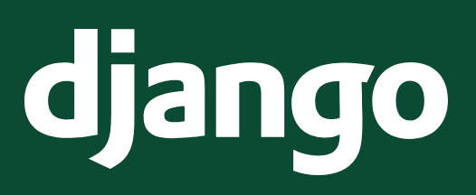

Djangoを知る
=====================

Djangoの概要について、簡単に知っておきましょう。

Djangoとは？
------------------

Django（ジャンゴと読みます）は、Python製のWebアプリケーションフレームワークです。

公式ウェブサイト（英語）: https://djangoproject.com/

Webアプリケーションを作るためにはいろいろな機能が必要ですが、DjangoはWebアプリケーション開発に必要な基本機能を一通り持っています。

* Djangoの機能（**超抜粋**）

  * HTTPリクエスト、レスポンスの抽象化
  * URLルーティング
  * アプリケーション分割の仕組み
  * プロジェクト設定
  * テキストテンプレートエンジン
  * データベース接続
  * ORマッパー
  * セッション
  * ユーザー認証
  * 管理画面

ひとまず「たくさん機能があるらしい」と思っといてください。

フレームワークとは？
-------------------------

DjangoのようなWebアプリケーションフレームワークでは、WebブラウザからのHTTPリクエストを受け取って処理する『枠組み（＝フレームワーク）』があらかじめ提供されます。

Djangoを使った開発では、アプリケーションの開発者はこの『枠組み』の中で動作するコードを書くことになります。

.. image:: images/web-framework.png

『枠組み』部分を自分で全部作ろうとするとかなり大変なので、このような仕組みになっています。

Djangoの情報
----------------

* ドキュメント

  * 公式ドキュメント（英語）: https://docs.djangoproject.com/en/5.0/
  * 公式ドキュメント（日本語）: https://docs.djangoproject.com/ja/5.0/

    * 日本語ドキュメントの文量はかなり多いです。
    * 有志の方が日本語翻訳をしてくれていますが、全文が翻訳済みというわけではない点に注意してください。
    * 公式ドキュメントにはDjangoの基本機能を使うチュートリアルがあります。このハンズオンのあとにやってみると、より理解が深まると思います。

* 書籍

  * 日本語の書籍が何冊も出版されています。おおむねDjangoのLTS（LongTermSupport＝長期サポート）バージョンに合わせて書かれているものが多いです。

* 日本のコミュニティ（django-ja）

  * ウェブサイト: https://djangoproject.jp/
  * Discordサーバーに質問や雑談などのチャンネルがあります: https://discord.gg/RZvawz6KgC
  * connpass: https://django.connpass.com/

    * 最近はオンラインミートアップがあるので、ぜひ参加してみてください

* 情報収集の参考記事

  * https://kimihito.hatenablog.com/entry/2023/09/22/164521
