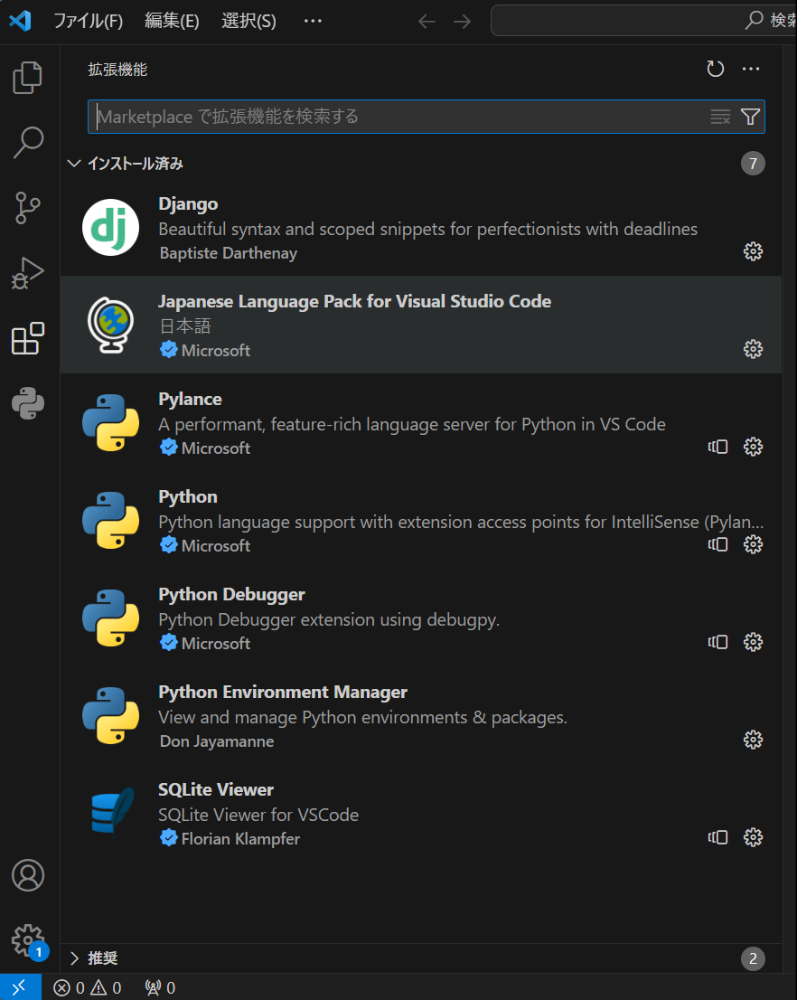
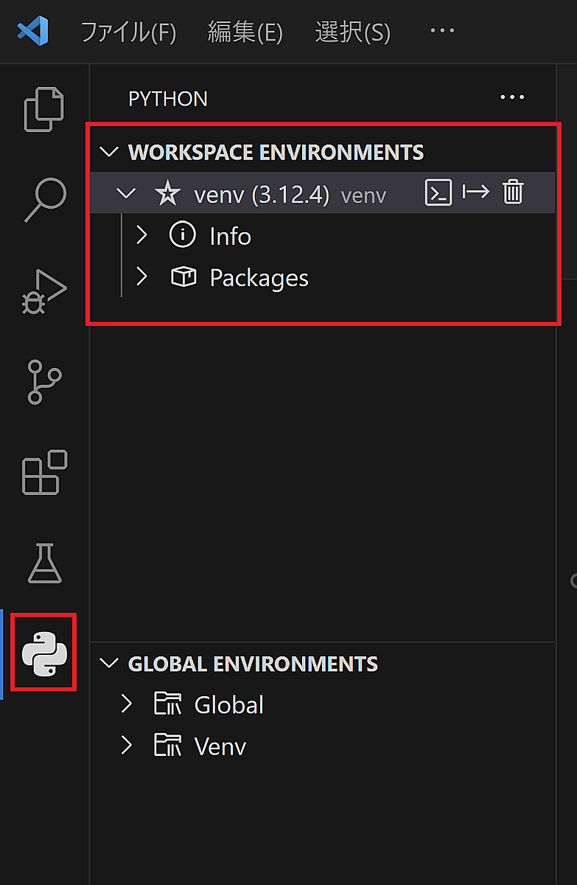
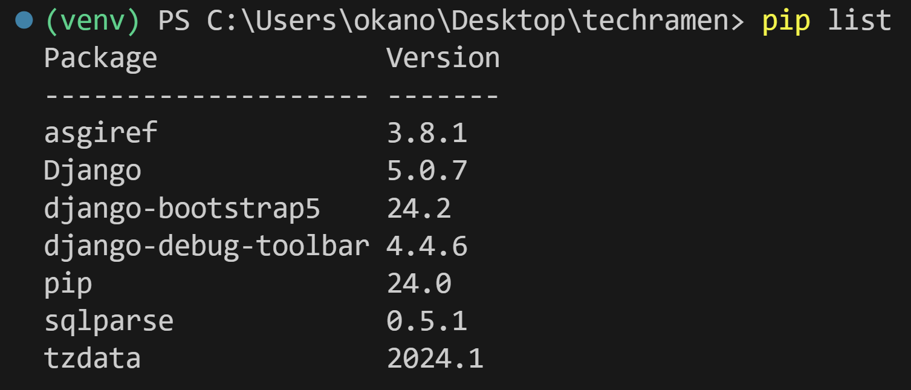

開発環境の準備
===================

PythonとDjangoフレームワークを使った開発に最低限必要なのは、テキストエディタとターミナル（PowerShellやコマンドプロンプトなど）です。

しかし、効率良く開発するに当たっては、Visual Studio Code（以降: VSCode）のような高機能なエディタ、統合開発環境（IDE）を使うことをおすすめします。

今回はVSCodeを利用します。

VSCodeの拡張機能
---------------------

次に列挙する拡張機能をインストールしてください:

* Japanese Language Pack for Visual Studio Code

  * 日本語化

* Python

  * Pythonを使って開発するための支援機能。依存で他の拡張機能もインストールされます。

* Python Environment Manager

  * Pythonの仮想環境（venv）の管理支援機能。

* Django

  * Django開発のための支援機能。

* SQLite Viewer

  * SQLite3データベースファイルのビューワー

VSCodeの拡張機能のインストール済みの一覧に次の拡張機能があれば大丈夫です。

.. tip:: もしVSCodeで他の拡張機能をたくさんインストールしていて競合してしまう場合は、[ファイル]-[ユーザー設定]-[プロファイル]-[プロファイルの作成]から別のプロファイルを作って作業してください。

作業用フォルダ
-----------------

開発を始める際には、作業用フォルダを1つ作っておき、そこから作業をはじめるとファイルが散らばらないのでおすすめです。

今回はデスクトップに ``techramen`` という名前のフォルダを作って、これを作業用フォルダとして使います。

デスクトップにフォルダを作ったら、VSCodeにフォルダをドラッグアンドドロップしてください。VSCodeでフォルダを開いた状態になるはずです。

.. image:: images/vscode-open-folder.png

ターミナル
----------------

VSCodeの場合、VSCode内で外部ターミナルを利用できます。起動してみましょう。

メニューの [ターミナル]-[新しいターミナル] を選ぶとターミナルが起動します。

.. image:: images/vscode-open-terminal.png

ターミナルではコンピューターの各種操作をコマンドで行います。慣れると複雑な操作をマウスやタッチで行うよりも素早くできます。

Python仮想環境の作成
------------------------

Pythonで開発する際、アプリケーションごとに利用するPythonのバージョンや、サードパーティ製パッケージのバージョンのセットを変更することがよくあります。

こういった場合に、『Python仮想環境』を作成することで毎回パッケージをインストールしなおす必要はなくなり、環境を切り替えるのが楽になります。

まずはターミナルでPythonのバージョンを確認しましょう。 ``-V`` オプションが

* Windowsの場合: ``py -3 -V``
* macOSの場合: ``python3 -V``
* Linuxの場合: ``python3 -V``

表示されたバージョンは、今回使おうとしているPythonバージョンと一致していますか？

もし一致しない場合は、マイナーバージョンを明示的にしていすると、該当のバージョンのPythonを起動できます。

* Windowsの場合: ``py -3.12 -V``
* macOSの場合: ``python3.12 -V``
* Linuxの場合: ``python3.12 -V``

.. image:: images/terminal-python-version.png

.. tip:: Windows用Pythonで利用できる ``py`` コマンドは、Pythonのバージョンを指定して起動できるランチャーアプリケーションです。 macOSやLinuxの場合は、通常 `python3.x` （x部分はマイナーバージョン）のようなコマンドで複数のバージョンを使い分けます。

Pythonのバージョンを確認できたら、組み込みの ``venv`` モジュールを使って、 ``venv`` という名前のPython仮想環境を作成します。

.. code-block::

   py -3.12 -m venv venv

Pythonコマンドを表す ``py -3.12`` の部分はOSごとに異なる部分ですので、macOSやLinuxを利用している場合は適宜変更してください。

仮想環境の有効化
---------------------

VSCodeにPython Environment Managerをインストールしている場合、この拡張機能の画面から作成した仮想環境（venv）を有効にできます。

拡張機能の画面を開いて、検出されたvenvの横にあるスターのアイコンをクリックします。マウスオーバーで `Set as active workspace interpreter` という表示が出るアイコンです。

ワークスペースでアクティブ状態のPythonインタープリターとして設定すると、新たに開いたターミナルは仮想環境が有効になっています。

メニューの[ターミナル]-[新しいターミナル]で、ターミナルを1つ新しく開いて確認してみましょう。

``(venv)`` の表示が出ていれば仮想環境が有効になっています。 ``python -V`` コマンドでPythonバージョンが想定通りになっているか確認しておきましょう。

.. image:: images/python-venv-new-terminal.png

.. tip::

   VSCodeのPython Environment Managerを使わずに独立したターミナル等で仮想環境を有効にしたい場合は、 `venv` フォルダ以下の仮想環境を有効化するためのスクリプトを実行します。

   Windows(PowerShell)の場合: ``venv\Scripts\Activate``
   macOS、Linuxの場合: ``source venv/scripts/activate``

   .. code-block::

      venv\Scripts\Activate   

   .. image:: images/python-venv-activate-terminal.png

サードパーティパッケージのインストール
-------------------------------------------

今回利用するサードパーティのパッケージは次の通りです。

* Django
* django-debug-toolbar
* django-bootstrap5

.. tip::

   Pythonの公式配布パッケージに含まれているモジュールは標準ライブラリ（標準モジュール）と呼びます。

   公式以外の人、組織が作成したパッケージをサードパーティパッケージと呼びます。

   サードパーティ製のパッケージは `Python Package Index(PyPI) <https://pypi.org/>`_ などで配布されています。

仮想環境が有効になっているターミナルで、 `pip` コマンドを使ってインストールします。

.. code-block::

   pip install Django django-debug-toolbar django-bootstrap5

今回バージョンを指定していませんが、Djangoは5.0系を想定しています。

インストールされたパッケージの一覧を確認するには ``pip list`` コマンドを使います。

インストールしたパッケージ一覧はVSCodeの拡張のPython Environment Managerでも確認できます。

.. image:: images/python-venv-manager-packages.png

問題ないことを確認したら、インストールしたパッケージとバージョンの一覧を `requirements.txt` に書き出しておきましょう。

.. code-block::

   pip freeze > requirements.txt

書き込んだらエディタで想定どおりの内容になっているか確認しておきましょう。

.. image:: images/requirements-txt.png

.. tip::

   ターミナルで、コマンドの後ろに ``> ファイル名`` のように記述して実行すると、実行したコマンドの標準出力（ターミナルに通常表示される文字）が、画面の変わりにファイルに出力されます。
