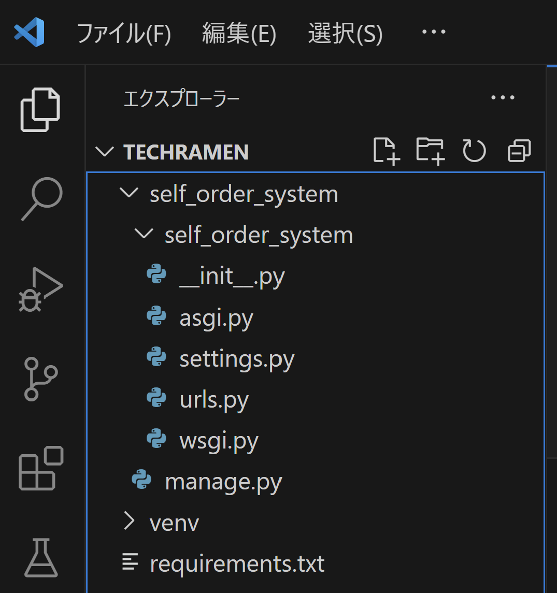
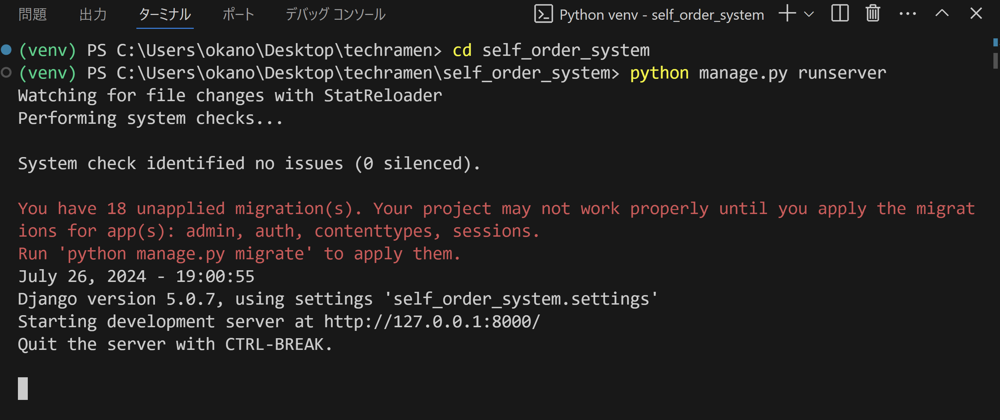
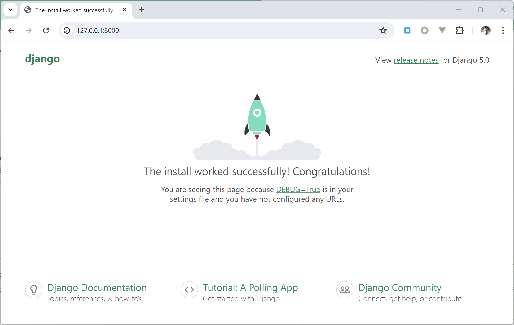
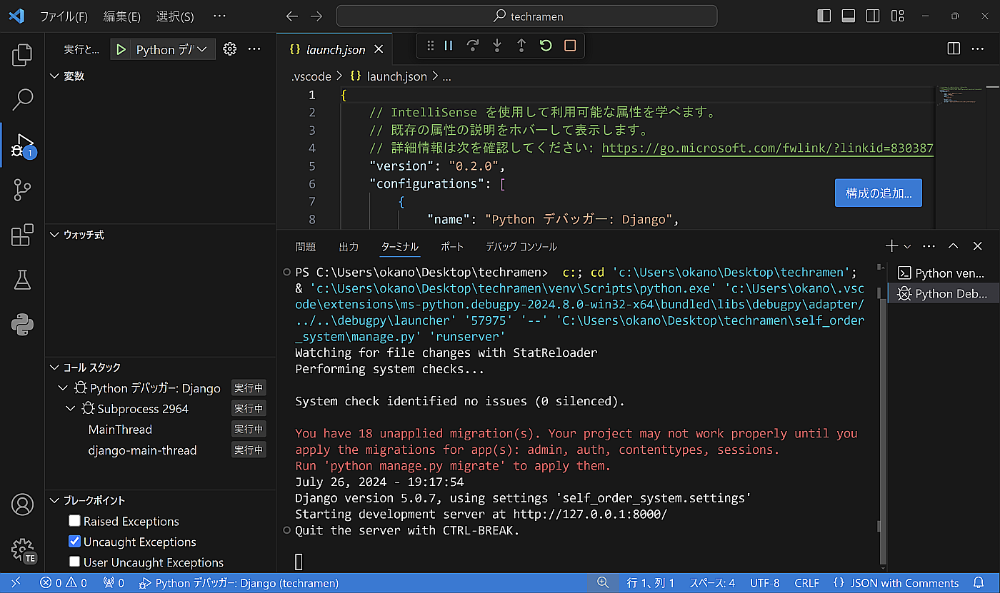
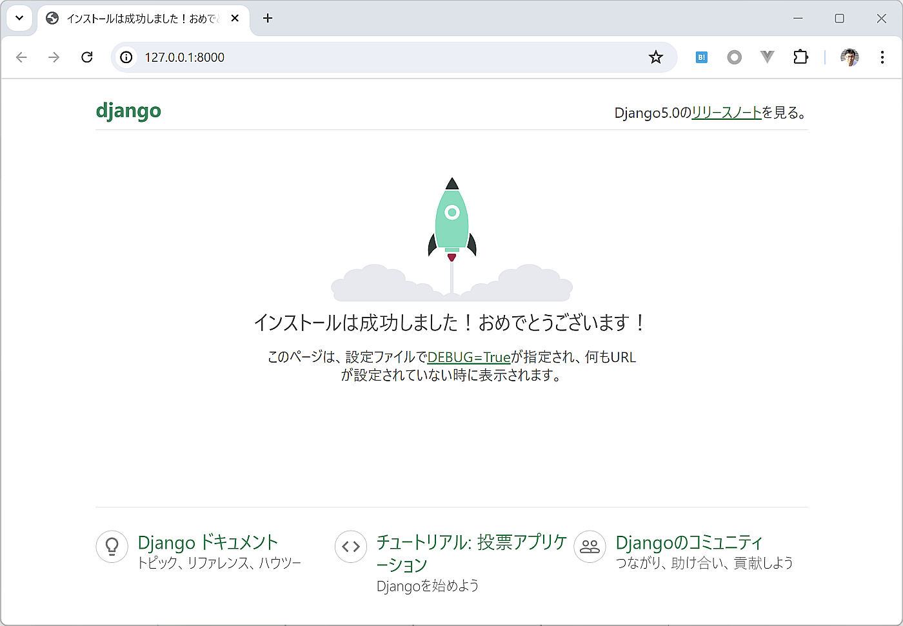

Djangoプロジェクトの作成と設定
========================================

Djangoのプロジェクトを作成して、開発用Webサーバーを起動してみます。

Djangoのプロジェクト作成
------------------------------

Djangoをインストールした仮想環境のターミナルでは管理コマンド ``django-admin`` を使用できます。

プロジェクトを作成する場合はサブコマンドの ``startproject`` を使います。今回、Djangoのプロジェクト名は ``self_order_system`` とします。

.. code-block::

   django-admin startproject self_order_system

コマンドが成功するとプロジェクトのファイル群が作成されます。ターミナルには特に表示はでません。

プロジェクト名として使用した ``self_order_system`` のフォルダ以下に、 `manage.py` ファイルと ``self_order_system`` のフォルダが作成され、 ``self_order_system`` フォルダ内にはいくつかのPythonモジュールが格納されています。

`manage.py` はDjangoプロジェクトの管理コマンドです。django-adminとは用途が異なります。プロジェクト専用のサブコマンドなどを利用できます。

.. tip::

   Djangoフレームワークを使ってWebアプリケーションを作成する場合、1つの **Djangoプロジェクト** の中に、複数の **Djangoアプリケーション** を作成します。
   「Djangoのプロジェクト」と言った場合は、startprojectサブコマンドで作成した親フォルダとそのフォルダ以下のファイル群を指す場合が多いです。

開発用Webサーバーの起動
--------------------------------

Djangoのプロジェクトを作成したので、開発用サーバーを動かしてみましょう。

仮想環境のターミナルで `manage.py` があるフォルダに ``cd`` コマンドで移動してから、 ``python manage.py runserver`` コマンドを実行します。

.. code-block::

   cd self_order_system
   python manage.py runserver

.. tip::

   ``python manage.py ...`` という管理コマンドはこのあと何度も出てきます。 `manage.py` ファイルが存在するフォルダにcdコマンドで移動してから実行するものだと思ってください。

   * ``cd`` コマンド: カレントフォルダを変更します。
   * ``ls`` コマンド: フォルダ内のファイル一覧を表示します。

正常にコマンドが実行された場合、開発用サーバーが起動した旨のメッセージが表示されます。

メッセージに書かれている通り、 http://127.0.0.1:8000/ にWebブラウザでアクセスしてみましょう。成功すればDjangoが動作した画面が表示されます。

起動した開発用サーバーを停止する場合は、コマンドをキャンセルします。 Windowsの場合はターミナルでCtrl+Break（[Ctrl]と[Break]キーを同時押し）、またはCtrl+Cを入力します。

VSCodeのデバッガー設定
--------------------------------

VSCodeで実行する場合は、VSCodeのデバッガー機能を利用したほうが開発しやすい場合が多いです。

Djangoの開発用サーバー（runserver）の実行をVSCodeからできるように設定してみましょう。

VSCodeのメニューから [実行]-[構成の追加] を選択すると、VSCode上部でデバッガーを選択するドロップダウンメニューが表示されます。

ドロップダウンメニューから [Python Debugger]-[Django] を選ぶと、 `manage.py` ファイルの場所を訊ねてくるので、候補として表示されている項目を選びます。

.. image:: images/vscode-debugger-manage.png

ここまでを行うと、 `.vscode` フォルダの中に `launch.json` というファイルが作成されます。これはVSCodeのデバッグ構成の設定ファイルです。

これでデバッガーの設定は完了です。試してみましょう。

ターミナルで起動していたrunserverコマンドがあれば停止をしてから、VSCodeでメニューから [実行]-[デバッグの開始] を選択、またはショートカットのF5キーを押します。

ターミナルから実行したのと同様に、Webブラウザで http://127.0.0.1:8000/ にアクセスして表示されることを確認しておきましょう。

日本語化
----------------

Djangoは標準で日本語に対応しています。

`self_order_system/self_order_system/settings.py` ファイルをエディタで開いて、 ``LANGUAGE_CODE`` の項目を探します。

デフォルト値は ``en-us`` となっています。 ``ja`` に変更します。

変更したら開発用サーバーを起動して、 http://127.0.0.1:8000/ にアクセスしてみましょう。

日本語で表示されましたか？

言語設定を日本語に変更すると、このようにDjangoの内部に含まれるテキストも日本語で表示されます。

管理画面や入力検証機能のメッセージ表示も日本語になるので、日本語で運用するのが前提のシステムでも採用しやすいです。

`settings.py` ファイルはDjangoの設定を変更する際に編集します。この後にも何度も出てくるので、『Djangoの設定を変更する場合はsettings.py』と覚えておいてください。

タイムゾーンの設定
-----------------------

もう一つ、最初の設定として、タイムゾーンを変更しておきましょう。

DjangoはデフォルトではタイムゾーンがUTC（世界標準時）に設定されています。

Django内部で現在日時を取得した場合に、このタイムゾーン設定が使われます。

`settings.py` で ``TIME_ZONE`` を探します。

デフォルト値は ``UTC`` となっています。日本のタイムゾーンである ``Asia/Tokyo`` に変更します。

この設定が機能しているかは、後ほど管理画面で確認しましょう。
