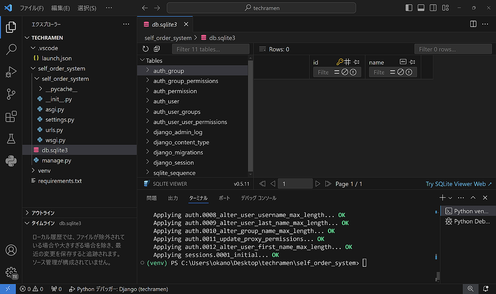
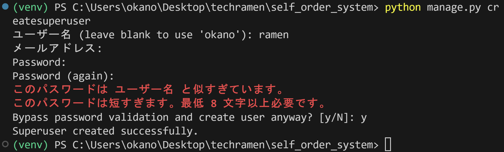
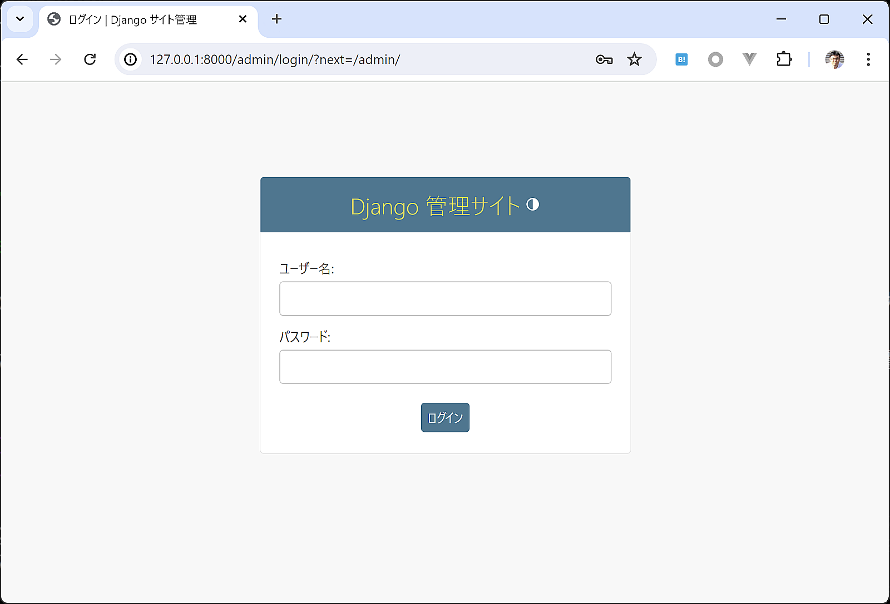
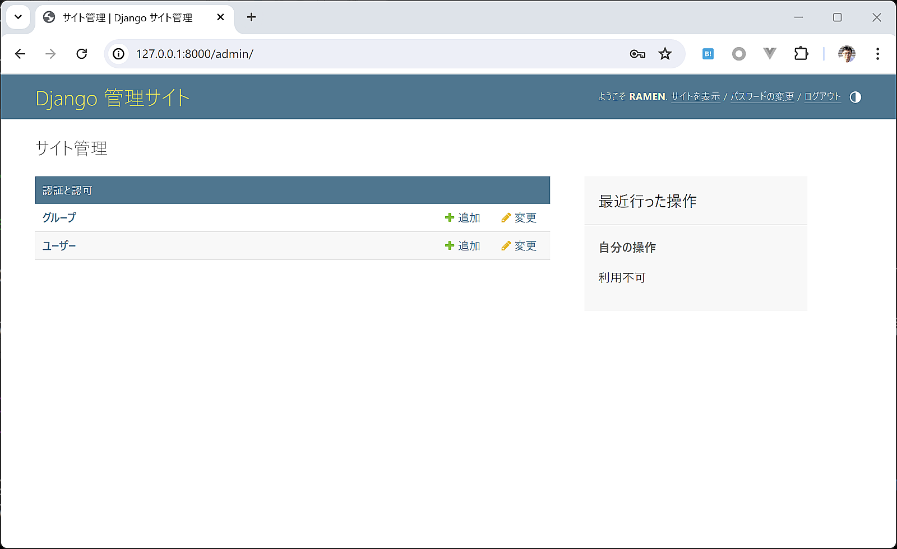

Django管理画面を利用する
=============================

データベースの作成
---------------------

Djangoプロジェクトはデフォルトで `SQLite <https://www.sqlite.org/>`_ のデータベースを使う設定になっています。

SQLiteは1つのファイルに複数のデータベーステーブルを保存できるソフトウェアです。

また、デフォルトでユーザー認証と管理画面のDjangoアプリケーションが有効になっており、これらの機能を使うためにはデータベース内のテーブルにデータを登録しておく必要があります。

早速データベースを作成しましょう。

DjangoでSQLiteを使う場合はテーブルを作成する際に自動的にデータベースファイルが作成されます。

データベーステーブルを作成する ``python manage.py migrate`` コマンドを実行します。

.. code-block::

   python manage.py migrate

`db.sqlite3` というファイルが作成されました。VSCodeの拡張機能でSQLite Viewerをインストールしているので、ファイルの開くとテーブルが作成されていることを確認できます。

.. tip::

   DjangoのSQLiteデータベースの読み書きは、Pythonの標準モジュールで実現しています。他のデータベースソフトウェアに接続する場合は、各データベースごとに対応したデータベースドライバー（Pythonのサードパーティパッケージ）のインストールが必要になります。

管理ユーザーの作成
---------------------

管理画面にログインするためのユーザーを作成しましょう。

`manage.py` のサブコマンドで `createsuperuser` コマンドを使用します。

.. code-block::

   python manage.py createsuperuser

作成するユーザーのユーザー名、メールアドレス、パスワードを訊ねてきます。メールアドレスは空でも大丈夫です。

パスワードの強度が低いと警告が表示されますがローカル環境だけで開発に使うデータベースであれば、警告を無視してユーザーを作成することもできます。

管理画面にログインする
---------------------------

デフォルトでDjango管理画面は有効になっています。開発用サーバーを起動した状態で http://127.0.0.1:8000/admin/ に接続してみましょう。ログイン画面が表示されるはずです。

先ほど ``createsuperuser`` コマンドで作成したユーザーでログインできます。

ログインすると、グループとユーザーの2つの管理項目が表示されています。

``ユーザー`` を選択して画面から、作成しておいたユーザー（この例では ``ramen`` ）の項目を選択し、編集画面に移動します。

この編集画面ではデータベースに登録されているユーザーの情報を編集できます。

画面をスクロールして一番下にある『最終ログイン:』の時刻を確認してください。日本時間で先ほどログインした時刻と一致していますか？

一致している場合は、 `settings.py` の ``TIME_ZONE`` 設定がうまく機能しています。

管理画面の確認は一旦ここまでにしましょう。次はいよいよDjangoのアプリケーションを作り始めます。
