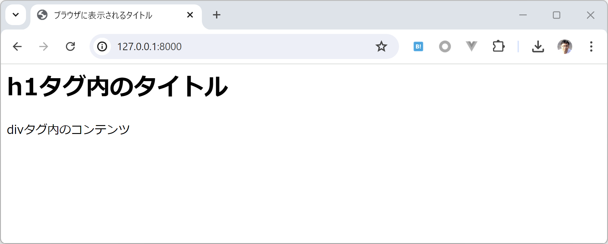

シンプルなテンプレートを使ったページの表示
============================================

views.pyの編集
----------------

まずはシンプルなHTMLを表示するだけのトップ画面の処理を作っていきましょう。

`self_order/views.py` を編集します。

self_order/views.py:

.. code-block:: python

   from django.shortcuts import render

   def index(request):
       '''セルフオーダーのトップページ'''
       return render(request, 'index.html')

``index`` はPythonの関数です。引数 ``request`` はDjangoフレームワークから渡されてくるHTTPリクエストを抽象化したPythonのオブジェクトです。

``render`` 関数は、Djangoでテンプレートファイルを使ってHTTPレスポンスを生成するショートカット関数です。

* 参考

  * https://docs.djangoproject.com/ja/5.0/ref/request-response/
  * https://docs.djangoproject.com/ja/5.0/topics/http/shortcuts/

テンプレートフォルダの作成と有効化
--------------------------------------

プロジェクトフォルダである `self_order_system` の中に `templates` というフォルダを作成します。

この `templates` フォルダにDjangoのテンプレートファイルを作成していきます。

テンプレートファイルの検索対象のフォルダとするため、 `settings.py` の ``TEMPLATES`` を変更します。

.. code-block:: python

   TEMPLATES = [
       {
           'BACKEND': 'django.template.backends.django.DjangoTemplates',
           'DIRS': [
               BASE_DIR / 'templates',  # プロジェクトフォルダ内のtemplatesをテンプレートフォルダにする
           ],
           'APP_DIRS': True,
           'OPTIONS': {
               'context_processors': [
                   'django.template.context_processors.debug',
                   'django.template.context_processors.request',
                   'django.contrib.auth.context_processors.auth',
                   'django.contrib.messages.context_processors.messages',
               ],
           },
       },
   ]

.. tip::

   テンプレートファイルを配置するフォルダについてはいろいろな流派があります。Djangoアプリケーション内に配置する、プロジェクトフォルダの外側に配置するなど...

   ここでは1つのフォルダ以下に一旦テンプレートファイルをまとめるため、新たに作成した `templates` フォルダを使うことにしています。

テンプレートファイルの作成
----------------------------------------

HTMLを生成するためのテンプレートファイルとして最初に2つ作成します。

templates/base.html:

.. code-block:: html+django

   <html lang="ja">
     <head>
       <meta charset="utf-8">
       <title></title>
     </head>
     <body>
       <h1>タイトル</h1>
       

         コンテンツ
       

     </body>
   </html>

templates/index.html:

.. code-block:: django

   

   ブラウザに表示されるタイトル

   h1タグ内のタイトル

   
   
divタグ内のコンテンツ

   

`index.html` から `base.html` を利用しています。 ```` という記述に注目してください。Djangoの **テンプレート継承** 機能を使っています。

`index.html` は、 `base.html` の内容を流用しつつ、 ```` の部分だけを書き換えたテンプレートファイルである、という意味になっています。

.. tip::

   テンプレート継承とレンダリング結果のイメージ図:

   .. image:: images/django-template-extends.png

* 参考:

  * https://docs.djangoproject.com/ja/5.0/topics/templates/
  * https://tokibito.hatenablog.com/entry/2024/03/01/223249

urls.pyの作成とプロジェクトルートのURL設定
------------------------------------------------

トップページのURL設定を準備します。

`self_order` フォルダの中に `urls.py` という名前のファイルを新規作成します。

self_order/urls.py:

.. code-block:: python

   from django.urls import path
   from . import views

   urlpatterns = [
       path('', views.index, name='index'),
   ]

この `self_order` アプリケーションのURL定義をプロジェクト内で有効にするため、既存のファイルである `self_order_system/urls.py` を編集します。

self_order_system/urls.py:

.. code-block:: python

   from django.contrib import admin
   from django.urls import path, include
   
   urlpatterns = [
       path('admin/', admin.site.urls),  # Django管理画面のURL設定(デフォルトで有効)
       path('', include('self_order.urls')),  # self_orderのURLを有効化
   ]

.. tip::

   VSCodeのデバッガーでrunserverを実行中の場合、モジュールの作成途中だとデバッガーがエラーを表示してくることがあります。モジュールを新たに追加していく際には一旦デバッガーは停止しておいたほうが作業がスムーズかもしれません。

トップページを表示してみる
---------------------------

開発用サーバーを起動して、 http://127.0.0.1:8000/ にアクセスしてみましょう。

テンプレートを使ったHTMLの表示ができました。

