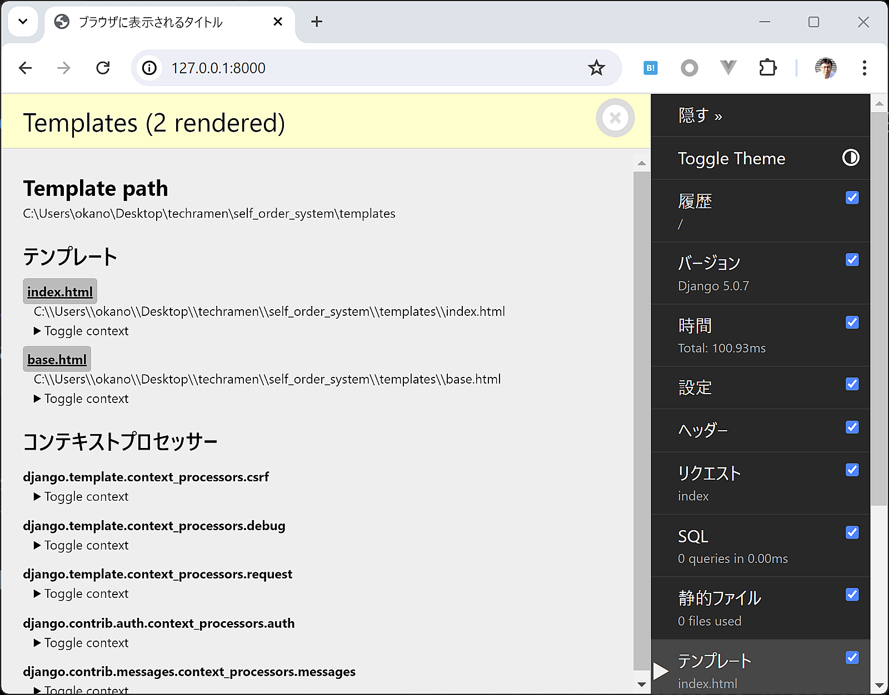

django-debug-toolbarの導入
=======================================

この後からコードが複雑になるため、django-debug-toolbarを導入します。

* 参考

  * https://docs.djangoproject.com/ja/5.0/intro/tutorial08/
  * https://django-debug-toolbar.readthedocs.io/en/latest/installation.html

django-debug-toolbarの有効化
-------------------------------

django-debug-toolbarの仮想環境へのインストールは済ませてあるので、有効化する設定のみを行います。

`settings.py` の ``INSTALLED_APPS`` を編集し、 ``debug_toolbar`` を追加します。

.. code-block:: python

   INSTALLED_APPS = [
       'django.contrib.admin',
       'django.contrib.auth',
       'django.contrib.contenttypes',
       'django.contrib.sessions',
       'django.contrib.messages',
       'django.contrib.staticfiles',
       'self_order',  # self_orderアプリケーションを有効化
       'debug_toolbar',  # django-debug-toolbar
   ]

`settings.py` の ``MIDDLEWARE`` を編集し、 ``'debug_toolbar.middleware.DebugToolbarMiddleware'`` を先頭の要素として追加します。

.. code-block:: python

   MIDDLEWARE = [
       'debug_toolbar.middleware.DebugToolbarMiddleware',  # django-debug-toolbar
       'django.middleware.security.SecurityMiddleware',
       'django.contrib.sessions.middleware.SessionMiddleware',
       'django.middleware.common.CommonMiddleware',
       'django.middleware.csrf.CsrfViewMiddleware',
       'django.contrib.auth.middleware.AuthenticationMiddleware',
       'django.contrib.messages.middleware.MessageMiddleware',
       'django.middleware.clickjacking.XFrameOptionsMiddleware',
   ]

`settings.py` に ``INTERNAL_IPS`` を **追記** します。

.. code-block:: python

   INTERNAL_IPS = [
       '127.0.0.1',
   ]

プロジェクトのURL設定 `self_order_system/urls.py` を編集して、django-debug-toolbarで必要なURL設定を追加します。

self_order_system/urls.py:

.. code-block:: python

   from django.contrib import admin
   from django.urls import path, include
   from debug_toolbar.toolbar import debug_toolbar_urls

   urlpatterns = [
       path('admin/', admin.site.urls),
       path('', include('self_order.urls')),  # self_orderのURLを有効化
   ]
   urlpatterns += debug_toolbar_urls()  # django-debug-toolbar

ここまで設定したら、runserverを起動した状態でトップページを確認してみましょう。

『DJDT』と書かれたバーが右側に表示され、クリックするとデバッグ用のパネルが開きます。パネルのメニューから『テンプレート』を選んでみてください。

.. image:: images/django-debug-toolbar-menu.png

この画面を表示するまでに使われたテンプレートや、テンプレートに渡された変数の内容を確認できます。

これでdjango-debug-toolbarを使えるようになりました。
