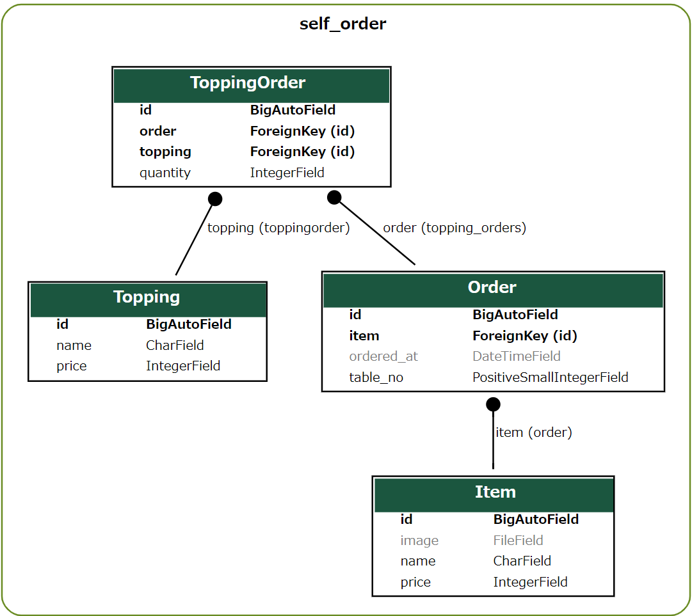

モデルの作成と管理画面からのデータ登録
===============================================

セルフオーダーシステムで扱うメニューとトッピング、注文データはデータベースに保存し、Django管理画面で登録、閲覧、編集できるようにします。

Djangoでデータベースを読み書きするためには、モデルを作成する必要があります。おおむね、1つのモデルがデータベース内の1つのテーブルと対応すると考えてください。

.. list-table::
   :header-rows: 1

   * - モデルクラス
     - 役割
   * - Item
     - メニューの商品を表します。『ラーメン』、『チャーハン』など
   * - Topping
     - メニューに追加するトッピングを表します。『チャーシュー』、『煮卵』、『のり』など
   * - Order
     - 注文を表します。テーブル番号、選択したメニュー、注文日時を保存します。
   * - ToppingOrder
     - トッピングの注文を表します。対応するトッピング、数量、対応する注文の情報を保存します。

ER図だと次のような形になります。

データベース設計についてはここでは詳しい説明はしません。動かしてみることで雰囲気を感じとってください。

モデルの作成
--------------------

`self_order/models.py` を編集し、各モデルを定義します。

self_order/models.py:

.. code-block:: python

   from django.db import models
   from django.core.validators import MinValueValidator, MaxValueValidator

   class Item(models.Model):
       '''商品'''
       name = models.CharField(max_length=100, verbose_name='商品名')
       price = models.IntegerField(verbose_name='価格')
       # 画像をアップロードするためのフィールド, Pillowをインストールしている場合は、ImageFieldを使用することができます。
       image = models.FileField(upload_to='images/', blank=True, null=True, verbose_name='画像')
   
       class Meta:
           verbose_name = verbose_name_plural = '商品'
   
       def __str__(self):
           return f'{self.name} ({self.price}円)'
   
   
   class Topping(models.Model):
       '''トッピング'''
       name = models.CharField(max_length=100, verbose_name='トッピング名')
       price = models.IntegerField(verbose_name='価格')
   
       class Meta:
           verbose_name = verbose_name_plural = 'トッピング'
   
       def __str__(self):
           return f'{self.name} ({self.price}円)'
   
   
   class ToppingOrder(models.Model):
       '''トッピング注文'''
       order = models.ForeignKey('Order', on_delete=models.CASCADE, related_name='topping_orders', verbose_name='注文')
       topping = models.ForeignKey(Topping, on_delete=models.CASCADE, verbose_name='トッピング')
       quantity = models.IntegerField(verbose_name='数量', validators=[MinValueValidator(1), MaxValueValidator(5)])
   
       class Meta:
           verbose_name = verbose_name_plural = 'トッピング注文'
   
       def __str__(self):
           return f'{self.topping} x {self.quantity}'
   
   
   class Order(models.Model):
       '''注文'''
       table_no = models.PositiveSmallIntegerField(
           verbose_name='テーブル番号', validators=[MinValueValidator(1), MaxValueValidator(10)])
       item = models.ForeignKey(Item, on_delete=models.CASCADE, verbose_name='商品')
       toppings = models.ManyToManyField(Topping, through=ToppingOrder, blank=True, verbose_name='トッピング')
       ordered_at = models.DateTimeField(auto_now_add=True, verbose_name='注文日時')
   
       class Meta:
           verbose_name = verbose_name_plural = '注文'
   
       def __str__(self):
           return f'{self.item} {list(self.topping_orders.all())}'
   
       @property
       def total_price(self):
           '''合計金額'''
           topping_orders = self.topping_orders.all()
           # 商品価格 + トッピング価格
           price = self.item.price
           for topping_order in topping_orders:
               price += topping_order.topping.price * topping_order.quantity
           return price

``ForeignKey`` は一対多関係のモデルを指定できます。 ``ManyToManyField`` は多対多関係のモデルを指定できます。

マイグレーションファイルの作成
--------------------------------------

モデルを作成したら、データベース上にテーブルを作るためのマイグレーションファイルを作成します。

マイグレーションファイルは基本的にプロジェクトの管理コマンド ``python manage.py makemigrations アプリ名`` で作成します。

.. code-block::

   python manage.py makemigrations self_order

.. image:: images/django-makemigrations-self_order.png

これで `self_order/models.py` に記述されたモデルのマイグレーションファイル `self_order/migrations/0001_initial.py` が作成されます。

マイグレーションファイルを作成しただけでは、データベースにはまだテーブルが作成されていません。次のマイグレーションの適用でテーブルが作成されます。

.. tip::

   データベースマイグレーションは、データベーステーブルの変更を管理するための仕組みです。データベースマイグレーションの仕組みがあると、テーブルの構造変更についてバージョン管理や異なる環境への適用がしやすくなります。

データベースマイグレーションの実行
-----------------------------------------

作成したマイグレーションファイルをデータベースに適用、つまりテーブルを実際に作成します。

``python manage.py migrate`` コマンドでマイグレーションを実行します。

.. code-block::

   python manage.py migrate

.. image:: images/django-migrate-self_order.png

`db.sqlite3` ファイルを開いてデータベーステーブルが作成されたことを確認しておきましょう。

.. image:: images/sqlite-self_order-created.png

モデルをDjango管理画面に登録する
------------------------------------

作成したモデルをDjango管理画面に登録すると、作成、閲覧、編集ができるようになります。

管理画面へモデルを登録するためには、 `self_order/admin.py` を編集します。

.. code-block:: python

   from django.contrib import admin
   from . import models
   
   
   @admin.register(models.Item)
   class ItemAdmin(admin.ModelAdmin):
       list_display = ('name', 'price', 'image')
   
   
   @admin.register(models.Topping)
   class ToppingAdmin(admin.ModelAdmin):
       list_display = ('name', 'price')
   
   
   @admin.register(models.ToppingOrder)
   class ToppingOrderAdmin(admin.ModelAdmin):
       list_display = ('order', 'topping', 'quantity')
   
   
   class ToppingOrderInline(admin.TabularInline):
       model = models.ToppingOrder
   
   
   @admin.register(models.Order)
   class OrderAdmin(admin.ModelAdmin):
       inlines = [ToppingOrderInline]
       list_display = ('table_no', '__str__', 'total_price', 'ordered_at')
       readonly_fields = ['total_price']

これで管理画面に各モデルが登録されます。

ファイルアップロードの設定
-----------------------------------

Itemモデルには ``FileField`` を使用しており、管理画面上ではファイルアップロードができるようになります。

しかしデフォルト状態ではアップロードしたファイルを参照する設定がないので、設定を追加する必要があります。

`settings.py` に ``MEDIA_ROOT`` と ``MEDIA_URL`` の設定を **追加** します。

.. code-block:: python

   # 画像をアップロードするための設定
   MEDIA_ROOT = BASE_DIR / 'media'
   MEDIA_URL = '/media/'

プロジェクトのURL設定である `self_order_system/urls.py` にアップロードされたファイルを参照するためのURL設定を追加します。

self_order_system/urls.py:

.. code-block:: python

   from django.contrib import admin
   from django.urls import path, include
   from debug_toolbar.toolbar import debug_toolbar_urls
   from django.conf import settings
   from django.conf.urls.static import static
   
   urlpatterns = [
       path('admin/', admin.site.urls),
       path('', include('self_order.urls')),  # self_orderのURLを有効化
   ]
   urlpatterns += debug_toolbar_urls()  # django-debug-toolbar
   urlpatterns += static(settings.MEDIA_URL, document_root=settings.MEDIA_ROOT)  # アップロードファイル

.. tip::

   アップロードされたファイルの取り扱いは、プロジェクトの要件やインフラ構成によって変わる事が多いです。

   このハンズオンで紹介している方法は、本番環境で運用するにはいくらか不都合がありますが、詳細は特に説明しません。

   気になる場合はDjangoプロジェクトのデプロイについて調べてみるとよいでしょう。

管理画面からデータを登録する
-----------------------------------

runserverを起動した状態で、管理画面にアクセスしてみましょう。

.. image:: images/django-admin-self_order.png

SELF_ORDERというグループで、各モデルの項目が表示されました。

商品を登録してみましょう。

登録する商品は何でも良いですが、思いつかなければ次の画像素材を使って『ラーメン』『チャーハン』を登録してみてください。

.. list-table::

   * - .. image:: images/ramen.png
     - .. image:: images/chahan.png

.. hint::

   このラーメンとチャーハンの画像はBingのCopilotを使って生成しています。

   生成AIぽさがよく出ている画像なのでツッコミどころはたくさんあります。

ここでは商品を次のように登録してみました。

.. list-table::
   :header-rows: 1

   * - 商品名
     - 価格
     - 画像
   * - ラーメン
     - 900
     - ramen.png
   * - チャーハン
     - 700
     - chahan.png

トッピングも登録しておきます。

ここではトッピングを次のように登録してみました。

.. list-table::
   :header-rows: 1

   * - トッピング名
     - 価格
   * - チャーシュー
     - 100
   * - 煮卵
     - 100
   * - のり
     - 60

モデルの作成からDjango管理画面でデータを登録する流れまでを実装できました。
