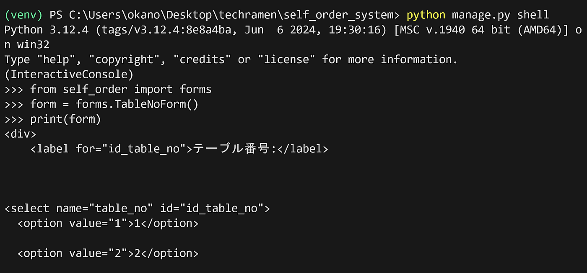
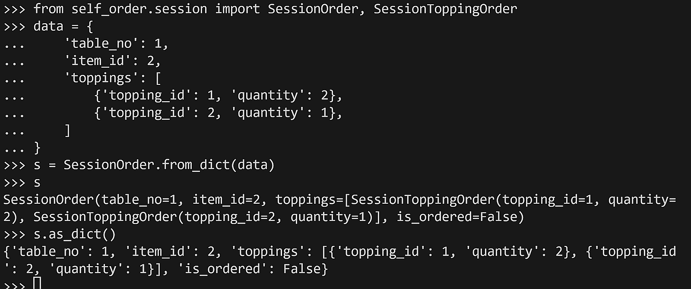
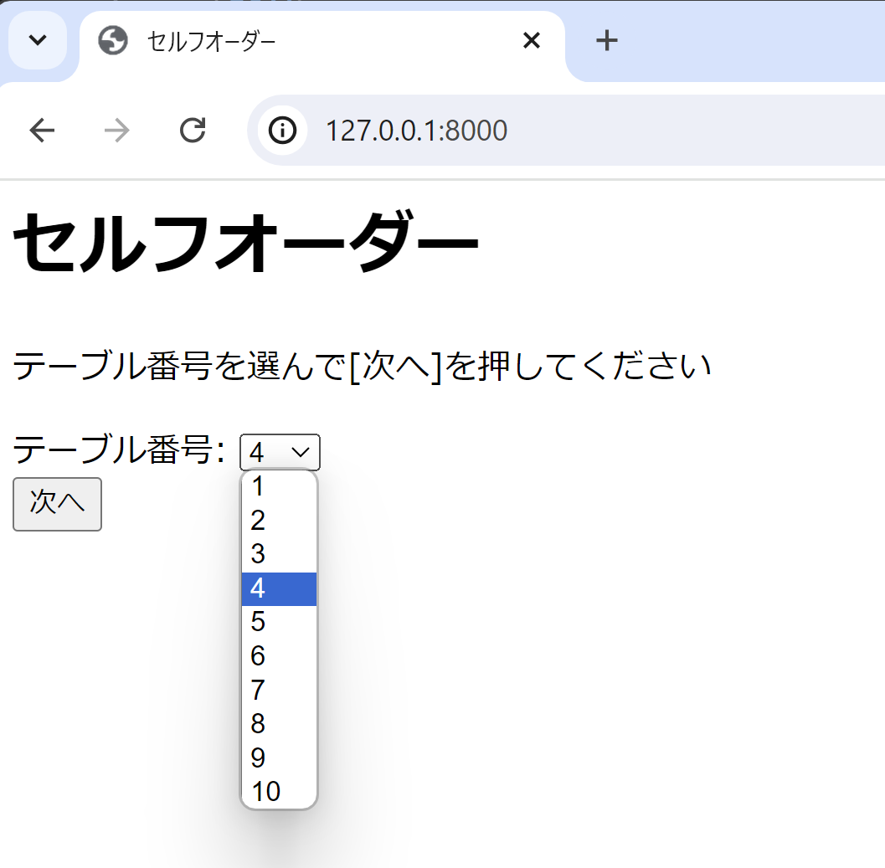

Djangoのフォームとセッションを利用する
===========================================

Djangoフォームの利用
-----------------------------

今回開発するセルフオーダーシステムは、各画面で入力した内容を元に次の画面を表示していく仕様としています。

HTMLのフォーム部分の入力をDjangoで扱う場合は、Djangoのフォーム機能を使います。

Djangoのフォームにはおおまかに次の3つの機能があります。

* HTMLフォーム内にレンダリングするinputタグなどの生成

  * 初期値の入ったinputタグや、selectタグ、入力エラーのメッセージもHTMLタグ込みで出力します

* HTMLフォームから送信された内容の検証

  * 入力値のルールに合致するか検証します

* HTMLフォームから送信された内容の変換

  * HTTPで送信された内容はすべてテキストですが、アプリ側で取り扱いやすいように数値や日付型などに変換します

後ほど各画面で使用するフォームをすべてここで定義しておきます。

`self_order` フォルダに `forms.py` という名前のファイルを新規作成します。

self_order/forms.py:

.. code-block:: python

   from django import forms
   from .models import Topping

   class TableNoForm(forms.Form):
       '''テーブル番号入力フォーム'''
       table_no = forms.IntegerField(
           label='テーブル番号', min_value=1, max_value=10,
           widget=forms.Select(choices=[(i, i) for i in range(1, 11)]))

   class SelectItemForm(forms.Form):
       '''商品選択フォーム'''
       item_id = forms.IntegerField(widget=forms.HiddenInput())

   class ToppingOrderForm(forms.Form):
       '''トッピングと数量を入力するフォーム'''
       topping = forms.ModelChoiceField(queryset=Topping.objects.all(), label='トッピング')
       quantity = forms.ChoiceField(
           choices=[('', '---------')] + [(i, i) for i in range(1, 6)],
           label='数量'
       )

   # トッピングと数量を複数入力するフォーム
   ToppingOrderFormSet = forms.formset_factory(ToppingOrderForm, extra=3)

   class ConfirmForm(forms.Form):
       '''注文確認フォーム'''
       is_ok = forms.BooleanField(widget=forms.HiddenInput(), required=True, initial=True)

* 参考

  * https://docs.djangoproject.com/ja/5.0/topics/forms/
  * https://docs.djangoproject.com/ja/5.0/topics/forms/formsets/

Djangoのシェルでフォームを試す
----------------------------------------

Djangoのフォーム機能を試す際、実際にviews.pyに組み込んで試すことはできますが、ブラウザから入力する手間など、トライアンドエラーに少し時間がかります。

フォーム機能の挙動を調査したり試すのであれば、Djangoシェルでフォームをimportして利用するのをおすすめします。

Djangoシェルは ``python manage.py shell`` で起動できます。

.. code-block::

   python manage.py shell

Djangoシェルを起動した状態で、 ``TableNoForm`` のHTMLを確認してみるには次のようにコードを実行します。

.. code-block:: python

   from self_order import forms
   form = forms.TableNoForm()
   print(form)

.. tip::

   Djangoシェルは、Djangoのプロジェクト設定が反映された状態のPython対話モードです。モデルの動作確認や、モデルを使ったデータの更新もDjangoシェルから行うと便利です。

   Djangoの公式チュートリアルにはDjangoシェルを使ってモデルを操作するトピックがあります。

   https://docs.djangoproject.com/ja/5.0/intro/tutorial02/

セッションを利用する
---------------------------

今回開発するセルフオーダーシステムでは、入力した注文データを別の画面に遷移した後も保持しておく必要があります。

このような仕組みを実現する方法はいくつかありますが、今回はDjangoのセッション機能を使って実現します。

Djangoのセッション機能は、Webアプリケーションでよくある、CookieにセッションIDを保持しておき、サーバー側にセッションデータを保持する仕組みです。

Djangoではセッション機能はデフォルトで有効になっており、手軽に利用できます。

``request.session`` はPythonの辞書ライクなオブジェクトとなっていて、ここにキーと値を追加すると、セッションデータとして保存され、複数のリクエストをまたがってデータを保持できるようになります。

セッション書き込みのコード例:

.. code-block::

   def index(request):
       request.sesson['my-data-key'] = 'my-data'
       # ...(省略)

セッション読み込みのコード例:

.. code-block::

   def index(request):
       my_data = request.sesson.get('my-data-key')
       # ...(省略)

.. tip::

   コンピューターの世界での『セッション』は、ある期間の一連のやりとりや、通信を表す言葉です。

現在のDjangoのデフォルト設定では、セッションデータはJSON形式にエンコードできる型だけを扱えます。

セッションに保存するデータは、Pythonの数値型、文字列型、リスト型、辞書型に変換してから ``request.session`` に保持する形とすると、トラブルが少ないです。

`views.py` に記述するアプリケーションの処理では構造化したオブジェクトで扱いつつ、 ``request.session`` に保存する際に手軽に辞書するような、相互に変換する機能を持つPythonのクラスを作成してみます。

注文データを表現する ``SessionOrder`` と、トッピング注文データを表現する ``SessionToppingOrder`` の2つです。

self_order/session.py

.. code-block:: python

   from typing import Optional
   from dataclasses import dataclass, field, asdict

   @dataclass
   class SessionToppingOrder:
       '''セッションに保持するトッピング注文データ'''
       topping_id: int
       quantity: int
   
       def __str__(self):
           return f'{self.topping_id} x {self.quantity}'
   
       @classmethod
       def from_dict(cls, data: dict):
           '''インスタンスを辞書から作成'''
           return cls(**data)

   @dataclass
   class SessionOrder:
       '''セッションに保持する注文データ'''
       table_no: int
       item_id: Optional[int] = None
       toppings: list[SessionToppingOrder] = field(default_factory=list)
       is_ordered: bool = False
   
       def __str__(self):
           return f'{self.item_id} {self.toppings}'
   
       def as_dict(self):
           '''インスタンスを辞書に変換'''
           return asdict(self)
   
       @classmethod
       def from_dict(cls, data: dict):
           '''インスタンスを辞書から作成'''
           toppings_data = data.pop('toppings', [])
           instance = cls(**data)
           toppings = []
           for topping_data in toppings_data:
               toppings.append(SessionToppingOrder.from_dict(topping_data))
           instance.toppings = toppings
           return instance

これはDjangoの機能には依存しておらず、Pythonの ``dataclasses`` モジュールを利用しています。

Djangoシェルで試すと次のような動作になります。

.. code-block:: python

   from self_order.session import SessionOrder, SessionToppingOrder
   data = {
       'table_no': 1,
       'item_id': 2,
       'toppings': [
           {'topping_id': 1, 'quantity': 2},
           {'topping_id': 2, 'quantity': 1},
       ]
   }
   s = SessionOrder.from_dict(data)
   s
   s.as_dict()

``from_dict`` と ``as_dict`` で相互に変換します。

このセッションにPythonの辞書に変換するクラスをトップページに組み込んで、セッションを使った実装をしていきます。

トップ画面でフォームとセッションを利用する
------------------------------------------------------

トップ画面に作成したフォームとセッションを組み込みます。

また、トップ画面のフォーム送信完了後のリダイレクト先として、メニュー画面も必要になるので、一緒に雛形だけ用意します。

self_order/views.py:

.. code-block:: python

   from django.shortcuts import render, redirect
   from django.views.generic import TemplateView
   
   from . import forms
   from .session import SessionOrder
   
   def index(request):
       '''セルフオーダーのトップ画面'''
       form = forms.TableNoForm(request.POST or None)
       if form.is_valid():
           table_no = form.cleaned_data['table_no']
           # セッションデータ作成
           session_order = SessionOrder(table_no=table_no)
           request.session['session_order'] = session_order.as_dict()
           # メニュー画面へリダイレクトする
           return redirect('menu')
       return render(request, 'index.html', {'form': form})
   
   class MenuView(TemplateView):
       '''メニュー画面'''
       template_name = 'menu.html'

`self_order/urls.py` にメニュー画面のURLを追加します。

self_order/urls.py:

.. code-block:: python

   from django.urls import path
   from . import views
   
   urlpatterns = [
       path('', views.index, name='index'),  # トップ画面
       path('menu/', views.MenuView.as_view(), name='menu'),  # メニュー画面
   ]

.. tip::

   index関数のように関数で実装されたビューを関数ビュー、MenuItemクラスのようにTemplateViewなどのクラスを継承して実装されたビューをクラスビューと呼びます。

   Djangoではどちらの書き方でも動作します。

   汎用性を気にするならクラスビューのほうが使いやすいですが、最初は関数ビューで作ってみたほうがわかりやすいかもしれません。

トップ画面のテンプレートファイルをフォームが表示されるように書き換えます。

templates/index.html:

.. code-block:: html+django

   
   
   セルフオーダー
   
   セルフオーダー
   
   
   
テーブル番号を選んで[次へ]を押してください

   <form action="" method="post">
     
     
   </form>
   

また、他の画面でも再利用するフォーム表示部品（フォームの表示とsubmitボタン）を汎用化するために `form.html` というファイルに分割しています。

`templates/form.html` も新規作成しておきます。

templates/form.html:

.. code-block:: html+django

   {{ form }}
   

     <button type="submit">{{ submit_text }}</button>
   

ここまで作成したら、runserverを起動してブラウザで http://127.0.0.1/ にアクセスしてみましょう。

正常に動作していれば、テーブル番号を選択するドロップダウンと『次へ』ボタンが表示されます。

