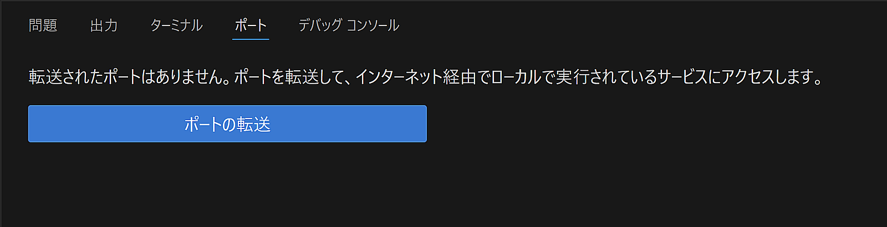
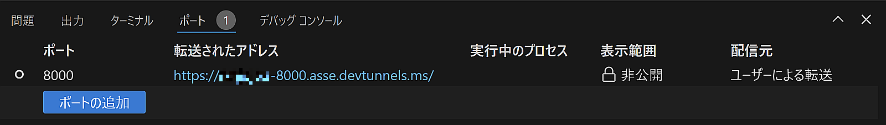
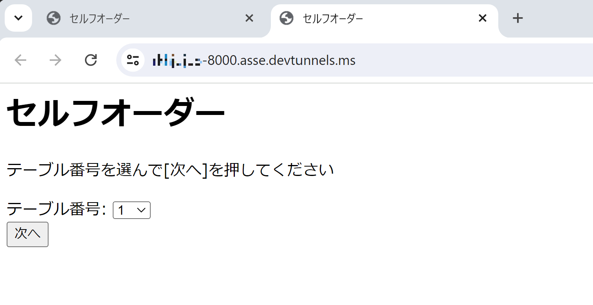
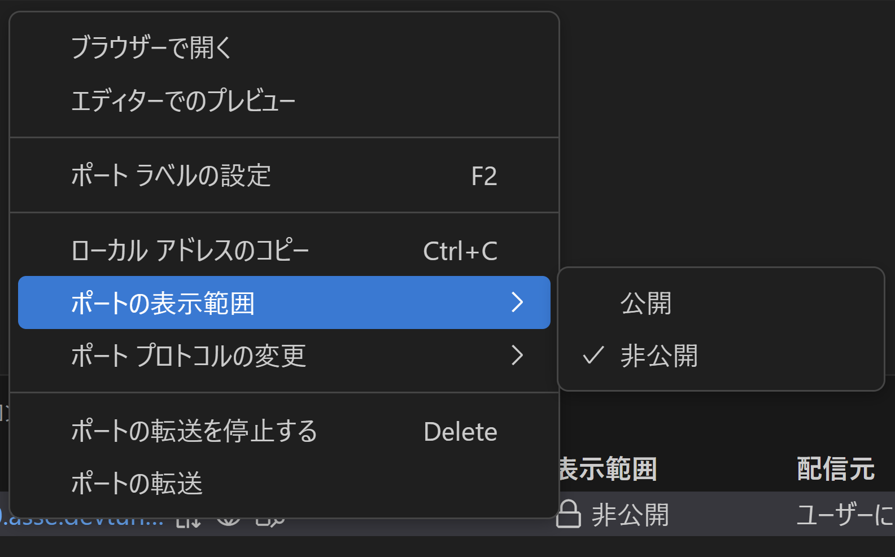
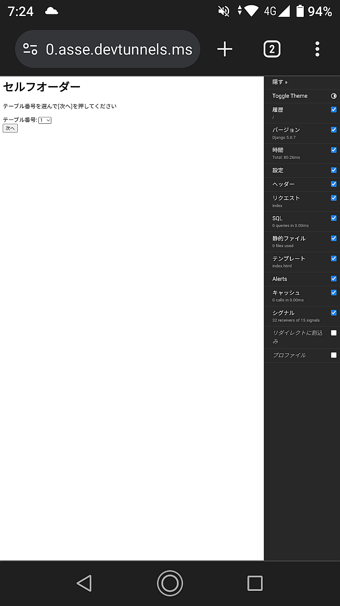

ポート転送機能で外部端末から動作確認
=============================================

画面を動かせるようになってきたので、スマートフォンで確認できるようにしてみます。

VSCodeにはポート転送機能があり、ローカル環境で起動しているWebサーバーにインターネット経由で接続することができます。

この機能を使用するためには、GitHubアカウントが必要です。

ポート転送を有効にする
--------------------------

VSCodeでターミナルが表示されているパネルに『ポート』というタブがあります。

『ポートの転送』をクリックします。

ポート番号の入力を求められるので、Djangoのrunserverの起動ポートである ``8000`` を指定します。

初回は認可画面がいくつか表示されるので、すべて許可をします。

アドレスが割当てられてポート転送が開始されると、接続可能なURLが表示されます。

パソコンのブラウザから開いて開いてみましょう。初回は認可画面が表示されるかもしれません。

スマートフォンでアクセスしてみる
----------------------------------------

表示範囲を公開にすると、アドレスを知っている人が誰でもアクセス可能です。

表示範囲を変更してスマートフォンで試しましょう。右クリックメニューから [ポートの表示範囲]-[公開] を選択します。

表示範囲が切り替わったら、ブラウザの右クリックメニューで『このページのQRコードを作成』を選んでURLのQRコードを作成し、スマートフォンのQRコードリーダーで読み込んでみましょう。

スマートフォンから画面を確認できました。ビューポートの設定などが無いので小さめに表示されます。
