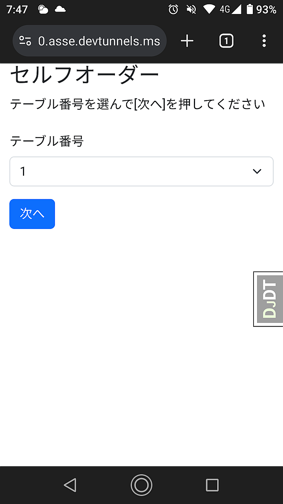

django-bootstrap5の導入
=====================================

スマートフォンでも見た目がよくなるように `Bootstrap5 <https://getbootstrap.jp/>`_ を導入してみましょう

django-bootstrap5を有効化
------------------------------

DjangoからBootstrap5を使う方法はいくつかありますが、 `django-bootstrap5 <https://django-bootstrap5.readthedocs.io/en/latest/>`_ を使うのが簡単です。

すでにインストールはしてあるので、有効化の設定とテンプレートファイルの作成を行います。

`settings.py` の ``INSTALLED_APPS`` に ``'django_bootstrap5',`` を追加します。

.. code-block:: python

   INSTALLED_APPS = [
       'django.contrib.admin',
       'django.contrib.auth',
       'django.contrib.contenttypes',
       'django.contrib.sessions',
       'django.contrib.messages',
       'django.contrib.staticfiles',
       'self_order',  # self_orderアプリケーションを有効化
       'debug_toolbar',  # django-debug-toolbar
       'django_bootstrap5',  # django-bootstrap5
   ]

テンプレートファイルの作成と変更
-----------------------------------------

テンプレートファイルを継承して使うため、 `bootstrap.html` を作成します。

templates/bootstrap.html:

.. code-block:: html+django

   

   

`base.html` の内容も変更します。

templates/base.html:

.. code-block:: html+django

   
   
   
   
   
   

       <h1>(no title)</h1>
   
       
   
       (no content)
   

   

`form.html` も変更します。

templates/form.html:

.. code-block:: html+django

   
   
   
     
   
     
   
   
   

     
   

これでスマートフォンから再度確認すると、Bootstrap5が適用されて見やすくなりました。

