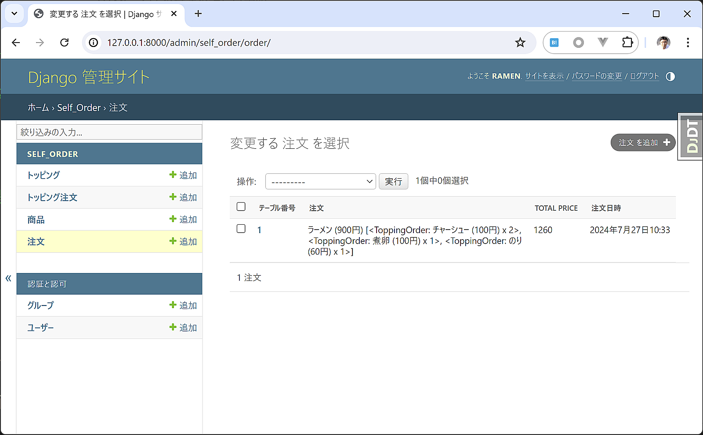

残りの画面の実装
===============================

メニュー画面、トッピング選択画面、確認画面、完了画面を実装していきます。

各画面をviews.pyに実装
----------------------------

最終形の ``views.py`` は次のようになります。

self_order/views.py:

.. code-block:: python

   from django.shortcuts import render, redirect
   from django.views.generic import TemplateView, FormView
   from django.urls import reverse_lazy
   
   from .models import Item, Topping, Order, ToppingOrder
   from . import forms
   from .session import SessionOrder, SessionToppingOrder
   
   def index(request):
       '''セルフオーダーのトップ画面'''
       form = forms.TableNoForm(request.POST or None)
       if form.is_valid():
           table_no = form.cleaned_data['table_no']
           # セッションデータ作成
           session_order = SessionOrder(table_no=table_no)
           request.session['session_order'] = session_order.as_dict()
           # メニュー画面へリダイレクトする
           return redirect('menu')
       return render(request, 'index.html', {'form': form})
   
   class MenuView(TemplateView):
       '''メニュー画面'''
       template_name = 'menu.html'
   
       def get_context_data(self, **kwargs):
           context = super().get_context_data(**kwargs)
           items = Item.objects.all()
           item_and_forms = []
           for item in items:
               form = forms.SelectItemForm(initial={'item_id': item.id})
               item_and_forms.append((item, form))
           context['item_and_forms'] = item_and_forms
           return context
   
       def post(self, request, *args, **kwargs):
           '''注文ボタンが押されたときの処理'''
           item_id = int(request.POST['item_id'])
           # セッションデータ取得
           session_order = SessionOrder.from_dict(request.session['session_order'])
           session_order.item_id = item_id
           # セッションデータを更新
           request.session['session_order'] = session_order.as_dict()
           # トッピング選択へリダイレクト
           return redirect('select_topping')
   
   class SelectToppingView(FormView):
       '''トッピング選択画面'''
       template_name = 'select_topping.html'
       form_class = forms.ToppingOrderFormSet
       success_url = reverse_lazy('confirm')
   
       def get_form_kwargs(self):
           kwargs = super().get_form_kwargs()
           # セッションデータ取得
           session_order = SessionOrder.from_dict(self.request.session['session_order'])
           # セッションに保存されているトッピングをフォームにセット
           initial_data = []
           for topping in session_order.toppings:
               initial_data.append({'topping': topping.topping_id, 'quantity': topping.quantity})
           kwargs['initial'] = initial_data
           return kwargs
   
       def form_valid(self, form):
           # セッションデータ取得
           session_order = SessionOrder.from_dict(self.request.session['session_order'])
           # トッピングをセット
           for form_part in form.forms:
               if form_part.cleaned_data:
                   topping = form_part.cleaned_data['topping']
                   quantity = form_part.cleaned_data['quantity']
                   session_order.toppings.append(SessionToppingOrder(topping_id=topping.id, quantity=quantity))
           # セッションデータを更新
           self.request.session['session_order'] = session_order.as_dict()
           return super().form_valid(form)
   
   class ConfirmView(FormView):
       '''注文確認画面'''
       template_name = 'confirm.html'
       form_class = forms.ConfirmForm
       success_url = reverse_lazy('complete')
   
       def get_context_data(self, **kwargs):
           context = super().get_context_data(**kwargs)
           # セッションデータ取得
           session_order = SessionOrder.from_dict(self.request.session['session_order'])
           context['session_order'] = session_order
           context['item'] = Item.objects.get(pk=session_order.item_id)
           topping_and_quantities = []
           for session_topping_order in session_order.toppings:
               topping = Topping.objects.get(pk=session_topping_order.topping_id)
               topping_and_quantities.append((topping, session_topping_order.quantity))
           context['topping_and_quantities'] = topping_and_quantities
           return context
   
       def form_valid(self, form):
           # セッションデータ取得
           session_order = SessionOrder.from_dict(self.request.session['session_order'])
           # 注文データを作成
           order = Order.objects.create(
               table_no=session_order.table_no,
               item_id=session_order.item_id,
           )
           # トッピング注文データを作成
           for topping in session_order.toppings:
               ToppingOrder.objects.create(
                   order=order,
                   topping_id=topping.topping_id,
                   quantity=topping.quantity,
               )
           # セッションデータを更新
           session_order.is_ordered = True
           self.request.session['session_order'] = session_order.as_dict()
           return super().form_valid(form)
   
   class CompleteView(TemplateView):
       '''注文完了画面'''
       template_name = 'complete.html'
   
       def get_context_data(self, **kwargs):
           context = super().get_context_data(**kwargs)
           # セッションデータ取得
           session_order = SessionOrder.from_dict(self.request.session['session_order'])
           context['session_order'] = session_order
           return context

URL設定
-----------------

追加したビューに対してURLを設定します。

self_orderアプリケーション内の `urls.py` の最終形は次の通りです。

self_order/urls.py:

.. code-block:: python

   from django.urls import path
   from . import views
   
   urlpatterns = [
       path('', views.index, name='index'),  # トップ画面
       path('menu/', views.MenuView.as_view(), name='menu'),  # メニュー画面
       path('select_topping/', views.SelectToppingView.as_view(), name='select_topping'),  # トッピング選択画面
       path('confirm/', views.ConfirmView.as_view(), name='confirm'),  # 確認画面
       path('complete/', views.CompleteView.as_view(), name='complete'),  # 完了画面
   ]

テンプレートファイルの作成
--------------------------------

メニュー画面、トッピング画面、確認画面、完了画面のテンプレートファイルを作成します。

templates/menu.html（メニュー画面）:

.. code-block:: html+django

   
   
   メニュー
   
   メニュー
   
   
   
メニューを選んでください

   
     

     

       {{ item.name }} {{ item.price }}円 
       
     

     <form action="" method="post">
       
       
     </form>
   
   

templates/select_topping.html（トッピング選択画面）:

.. code-block:: html+django

   
   
   トッピング選択
   
   トッピング選択
   
   
   
トッピングを選んで[次へ]を押してください

   <form action="" method="post">
     
     
   </form>
   

templates/confirm.html（確認画面）:

.. code-block:: html+django

   
   
   注文確認
   
   注文確認
   
   
   
注文内容をご確認ください。[注文を確定する]を押してください

   

     

       {{ session_order.table_no }}番テーブル
     

     

       
     

     

       {{ item.name }}
     

     

       
         トッピング:
         <ul>
           
             <li>{{ topping.name }} x {{ quantity }}</li>
           
         </ul>
       
     

   

   <form action="" method="post">
     
     
   </form>
   

templates/complete.html（完了画面）:

.. code-block:: html+django

   
   
   注文完了
   
   注文完了
   
   
   
注文が完了しました。提供までしばらくお待ちください。

   

動作確認
-------------

ここまで実装したら、スマートフォンで引き続き動作確認をしてみましょう。

テーブル番号を入力、メニューを選択、トッピングを選択、確認画面、完了画面の順に最後まで移動できましたか？

完了画面まで進めたら、管理画面のほうで注文データが保存されているか見てみましょう。

管理画面の注文にデータが想定通り保存されていれば完成です！
