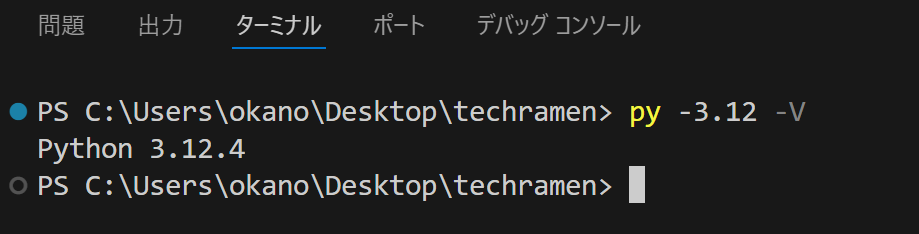

========================================
TechRAMEN 2024 Conference ハンズオン
========================================

.. toctree::
   :maxdepth: 2
   :caption: Contents:

ハンズオン概要
==================

:日時: 2024/7/27(土) 12:30～16:00 ※終了時間は前後する可能性があります
:場所: チャーシュー - [セッション/ハンズオン] 1F 第一会議室
:持ち物:
    * ノートパソコン（OSはWindows, macOS, Linuxのいずれか）
    * 充電アダプタ（3時間以上なのでバッテリー切れに注意してください）
    * スマートフォン（QRコードを読んでURLを開く操作をします。動作確認もスマートフォンで行います）

Python製のWebアプリケーションフレームワークである `Django <https://www.djangoproject.com/>`_ （ジャンゴと読みます）の使い方を学ぶハンズオンセッションです。

飲食店などで使われている、スマートフォンから商品を注文できる、セルフオーダーシステムの簡易版をDjangoで作ります。

HTML、CSSを使ってウェブページを作ったことがある、Webアプリケーションについて勉強し始め、くらいの方を想定した内容です。

事前準備
==================

作業をスムーズに進めるために、事前準備をお願いします。

* Pythonのインストール

  * 推奨は最新の安定版 Python 3.12
  * Django 5.0はPython 3.10以上をサポートしているため、 3.10 以上のバージョンをインストールしてください。
  * WindowsとmacOSの場合はオフィシャルサイトで配布されているインストーラーを推奨します。

    * https://www.python.org/downloads/

  * Linuxの場合はvenvモジュールを使えるようにしてください。

    * Ubuntuの場合は `python3-venv` パッケージなど。
    * Ubuntuの場合に、 `Deadsnakes PPA <https://launchpad.net/~deadsnakes/+archive/ubuntu/ppa>`_ を使うと、新しいバージョンのPythonのインストールが簡単です。

* Visual Studio Code（VSCode）のインストール

  * https://azure.microsoft.com/ja-jp/products/visual-studio-code
  * 拡張機能

    * Japanese Language Pack for Visual Studio Code
    * Python
    * Python Environment Manager
    * Django
    * SQLite Viewer

* GitHubアカウントの登録

  * VSCodeでインターネット経由のポート転送機能を使うためには、GitHubアカウントが必要になります。事前にアカウントを登録しておくと作業がスムーズです。
  * https://github.com/

資料とサンプルコードについて
==================================

* 資料はGitHub Pagesでホストしています。
* 資料とサンプルコードはGitHubリポジトリで公開しています。
* https://github.com/tokibito/techramen-handson

以下準備中...
================

ハンズオンについて
=====================

このハンズオンで学んでほしいこと、やらないこと
----------------------------------------------------

* このハンズオンで学んでほしいこと

  * Djangoを使って開発するための環境整備
  * Djangoを使った開発の流れ
  * Djangoアプリケーションのデバッグ方法

* このハンズオンでやらないこと

  * Pythonの文法の詳しい説明
  * HTML、CSSの文法の詳しい説明
  * Djangoの各機能の詳しい説明

『Djangoを使ってアプリケーションを開発する流れ』を経験してもらうことが一番の目的です。

一度アプリケーションを完成まで作る手順を経験しておけば、書籍や他のDjangoのチュートリアルで学習するのもスムーズになると思います。

ハンズオンの進め方
---------------------------------

* 講師: 資料と手順の説明を10～15分程度
* 参加者: 資料の手順通りにコードを打ち込み、手元で動かしてみる 10～15分程度

これを繰り返して進めていく形となります。1時間に1回、休憩の時間を設けますが、トイレなどは随時行って頂いて構いません。

コードの入力はすべて打ち込みだとだと時間がかかるので、資料からコピー＆ペーストしても大丈夫です。

不明点は随時質問してください。スムーズに進行できるよう、ご協力をお願いします。

Djangoを知る
=====================

Djangoの概要について、簡単に知っておきましょう。

Djangoとは？
------------------

.. image:: images/django-logo.png

Django（ジャンゴと読みます）は、Python製のWebアプリケーションフレームワークです。

公式ウェブサイト（英語）: https://djangoproject.com/

Webアプリケーションを作るためにはいろいろな機能が必要ですが、DjangoはWebアプリケーション開発に必要な基本機能を一通り持っています。

* Djangoの機能（**超抜粋**）

  * HTTPリクエスト、レスポンスの抽象化
  * URLルーティング
  * アプリケーション分割の仕組み
  * プロジェクト設定
  * テキストテンプレートエンジン
  * データベース接続
  * ORマッパー
  * セッション
  * ユーザー認証
  * 管理画面

ひとまず「たくさん機能があるらしい」と思っといてください。

フレームワークとは？
-------------------------

DjangoのようなWebアプリケーションフレームワークでは、WebブラウザからのHTTPリクエストを受け取って処理する『枠組み（＝フレームワーク）』があらかじめ提供されます。

Djangoを使った開発では、アプリケーションの開発者はこの『枠組み』の中で動作するコードを書くことになります。

.. image:: images/web-framework.png

『枠組み』部分を自分で全部作ろうとするとかなり大変なので、このような仕組みになっています。

Djangoの情報
----------------

* ドキュメント

  * 公式ドキュメント（英語）: https://docs.djangoproject.com/en/5.0/
  * 公式ドキュメント（日本語）: https://docs.djangoproject.com/ja/5.0/

    * 日本語ドキュメントの文量はかなり多いです。
    * 有志の方が日本語翻訳をしてくれていますが、全文が翻訳済みというわけではない点に注意。

* 書籍

  * 日本語の書籍が何冊も出版されています。おおむねDjangoのLTS（LongTermSupport＝長期サポート）バージョンに合わせて書かれているものが多いです。

* 日本のコミュニティ（django-ja）

  * ウェブサイト: https://djangoproject.jp/
  * Discordサーバーに質問や雑談などのチャンネルがあります: https://discord.gg/RZvawz6KgC
  * connpass: https://django.connpass.com/

    * 最近はオンラインミートアップがあるので、ぜひ参加してみてください

* 情報収集の参考記事

  * https://kimihito.hatenablog.com/entry/2023/09/22/164521

今日作成するアプリケーション
==========================================

今日、Djangoを使って作ってみるアプリケーションについて説明します。

セルフオーダーシステム
-----------------------------

最近は飲食店でもよく使われるようになったセルフオーダーシステムを作ります。

完成後のアプリケーションの操作の流れは次の通りです:

1. トップ画面ではテーブル番号を入力
2. メニューを選ぶ（1つの注文では1個だけ）
3. トッピングと個数を選ぶ
4. 確認画面を表示
5. 完了画面を表示
6. 管理画面で注文内容を確認できる

.. list-table::

   * - .. image:: images/self-order-top.png
     - .. image:: images/self-order-menu.png
     - .. image:: images/self-order-topping.png
     - .. image:: images/self-order-confirm.png
     - .. image:: images/self-order-complete.png

.. list-table::

   * - .. image:: images/self-order-admin.png

開発環境の準備
===================

PythonとDjangoフレームワークを使った開発に最低限必要なのは、テキストエディタとターミナル（PowerShellやコマンドプロンプトなど）です。

しかし、効率良く開発するに当たっては、Visual Studio Code（以降: VSCode）のような高機能なエディタ、統合開発環境（IDE）を使うことをおすすめします。

今回はVSCodeを利用します。

VSCodeの拡張機能
---------------------

次に列挙する拡張機能をインストールしてください:

* Japanese Language Pack for Visual Studio Code

  * 日本語化

* Python

  * Pythonを使って開発するための支援機能。依存で他の拡張機能もインストールされます。

* Python Environment Manager

  * Pythonの仮想環境（venv）の管理支援機能。

* Django

  * Django開発のための支援機能。

* SQLite Viewer

  * SQLite3データベースファイルのビューワー

VSCodeの拡張機能のインストール済みの一覧に以下の拡張機能があれば大丈夫です。

.. image:: images/vscode-extensions.png

.. note:: もしVSCodeで他の拡張機能をたくさんインストールしていて競合してしまう場合は、[ファイル]-[ユーザー設定]-[プロファイル]-[プロファイルの作成]から別のプロファイルを作って作業してください。

作業用フォルダ
-----------------

開発を始める際には、作業用フォルダを1つ作っておき、そこから作業をはじめるとファイルが散らばらないのでおすすめです。

今回はデスクトップに `techramen` という名前のフォルダを作って、これを作業用フォルダとして使います。

デスクトップにフォルダを作ったら、VSCodeにフォルダをドラッグアンドドロップしてください。VSCodeでフォルダを開いた状態になるはずです。

ターミナル
----------------

VSCodeの場合、VSCode内で外部ターミナルを利用できます。起動してみましょう。

メニューの [ターミナル]-[新しいターミナル] を選ぶとターミナルが起動します。

ターミナルではコンピューターの各種操作をコマンドで行います。慣れると複雑な操作をマウスやタッチで行うよりも素早くできます。

Python仮想環境の作成
------------------------

Pythonで開発する際、アプリケーションごとに利用するPythonのバージョンや、サードパーティ製パッケージのバージョンのセットを変更することがよくあります。

こういった場合に、『Python仮想環境』を作成することで毎回パッケージをインストールしなおす必要はなくなり、環境を切り替えるのが楽になります。

まずはターミナルでPythonのバージョンを確認しましょう。 `-V` オプションが

* Windowsの場合: `py -3 -V`
* macOSの場合: `python3 -V`
* Linuxの場合: `python3 -V`

表示されたバージョンは、今回使おうとしているPythonバージョンと一致していますか？

もし一致しない場合は、マイナーバージョンを明示的にしていすると、該当のバージョンのPythonを起動できます。

* Windowsの場合: `py -3.12 -V`
* macOSの場合: `python3.12 -V`
* Linuxの場合: `python3.12 -V`

.. note:: Windows用Pythonで利用できる `py` コマンドは、Pythonのバージョンを指定して起動できるランチャーアプリケーションです。 macOSやLinuxの場合は、通常 `python3.x` （x部分はマイナーバージョン）のようなコマンドで複数のバージョンを使い分けます。

Pythonのバージョンを確認できたら、組み込みの `venv` モジュールを使って、 `venv` という名前のPython仮想環境を作成します。

.. code-block::

   py -3.12 -m venv venv

Pythonコマンドを表す `py -3.12` の部分はOSごとに異なる部分ですので、macOSやLinuxを利用している場合は適宜変更してください。

仮想環境の有効化
---------------------

VSCodeにPython Environment Managerをインストールしている場合、この拡張機能の画面から作成した仮想環境（venv）を有効にできます。

拡張機能の画面を開いて、検出されたvenvの横にあるスターのアイコンをクリックします。マウスオーバーで `Set as active workspace interpreter` という表示が出るアイコンです。

ワークスペースでアクティブ状態のPythonインタープリターとして設定すると、新たに開いたターミナルは仮想環境が有効になっています。

.. image:: images/python-venv-manager.png

メニューの[ターミナル]-[新しいターミナル]で、ターミナルを1つ新しく開いて確認してみましょう。

`(venv)` の表示が出ていれば仮想環境が有効になっています。 `python -V` コマンドでPythonバージョンが想定通りになっているか確認しておきましょう。

.. image:: images/python-venv-new-terminal.png

.. note::

   VSCodeのPython Environment Managerを使わずに独立したターミナル等で仮想環境を有効にしたい場合は、 `venv` フォルダ以下の仮想環境を有効化するためのスクリプトを実行します。

   Windows(PowerShell)の場合: `venv\Scripts\Activate`
   macOS、Linuxの場合: `venv/scripts/activate`

   .. code-block::

      venv\Scripts\Activate   

   .. image:: images/python-venv-activate-terminal.png
