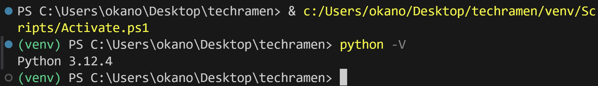
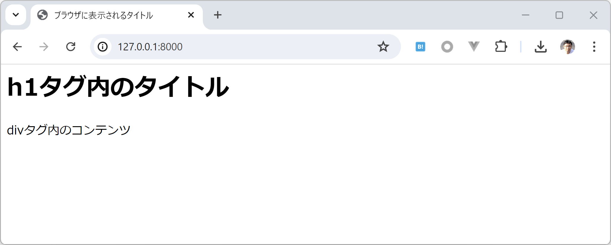
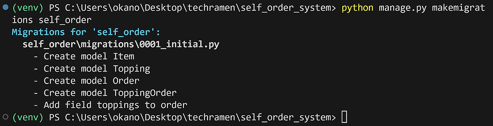

========================================
TechRAMEN 2024 Conference ハンズオン
========================================

.. toctree::
   :maxdepth: 2
   :caption: Contents:

ハンズオン概要
==================

:日時: 2024/7/27(土) 12:30～16:25 ※終了時間は前後する可能性があります
:場所: チャーシュー - [セッション/ハンズオン] 1F 第一会議室
:持ち物:
    * ノートパソコン（OSはWindows, macOS, Linuxのいずれか）
    * 充電アダプタ（3時間以上なのでバッテリー切れに注意してください）
    * スマートフォン（QRコードを読んでURLを開く操作をします。動作確認もスマートフォンで行います）

Python製のWebアプリケーションフレームワークである `Django <https://www.djangoproject.com/>`_ （ジャンゴと読みます）の使い方を学ぶハンズオンセッションです。

飲食店などで使われている、スマートフォンから商品を注文できる、セルフオーダーシステムの簡易版をDjangoで作ります。

HTML、CSSを使ってウェブページを作ったことがある、Webアプリケーションについて勉強し始め、くらいの方を想定した内容です。

事前準備
==================

作業をスムーズに進めるために、事前準備をお願いします。

* Pythonのインストール

  * 推奨は最新の安定版 Python 3.12
  * Django 5.0はPython 3.10以上をサポートしているため、 3.10 以上のバージョンをインストールしてください。
  * WindowsとmacOSの場合はオフィシャルサイトで配布されているインストーラーを推奨します。

    * https://www.python.org/downloads/

  * Linuxの場合はvenvモジュールを使えるようにしてください。

    * Ubuntuの場合は `python3-venv` パッケージなど。
    * Ubuntuの場合に、 `Deadsnakes PPA <https://launchpad.net/~deadsnakes/+archive/ubuntu/ppa>`_ を使うと、新しいバージョンのPythonのインストールが簡単です。

* Visual Studio Code（VSCode）のインストール

  * https://azure.microsoft.com/ja-jp/products/visual-studio-code
  * 拡張機能

    * Japanese Language Pack for Visual Studio Code
    * Python
    * Python Environment Manager
    * Django
    * SQLite Viewer

* GitHubアカウントの登録

  * VSCodeでインターネット経由のポート転送機能を使うためには、GitHubアカウントが必要になります。事前にアカウントを登録しておくと作業がスムーズです。
  * https://github.com/

資料とサンプルコードについて
==================================

* 資料はGitHub Pagesでホストしています。
* 資料とサンプルコードはGitHubリポジトリで公開しています。
* https://github.com/tokibito/techramen-handson

以下準備中...
================

ハンズオンについて
=====================

このハンズオンで学んでほしいこと、やらないこと
----------------------------------------------------

* このハンズオンで学んでほしいこと

  * Djangoを使って開発するための環境整備
  * Djangoを使った開発の流れ
  * Djangoアプリケーションのデバッグ方法

* このハンズオンでやらないこと

  * Pythonの文法の詳しい説明
  * HTML、CSSの文法の詳しい説明
  * Djangoの各機能の詳しい説明
  * SQLやデータベースの詳しい説明
  * ターミナルコマンドの使い方や詳しい説明

『Djangoを使ってWebアプリケーションを開発する流れ』を経験してもらうことが一番の目的です。

各手順の大まかな意味は説明しますが、コードの詳細についての説明は時間が足りないので省略します。

一度Webアプリケーションを完成まで作る手順を経験しておき、書籍や他のDjangoのチュートリアルで学習するきっかけとしてください。

ハンズオンの進め方
---------------------------------

* 講師: 資料の手順の説明を10～15分程度。
* 参加者: 資料の手順通りにコードを打ち込み、手元で動かしてみる 10～15分程度

これを繰り返して進めていく形となります。1時間に1回、休憩の時間を設けますが、トイレなどは随時行って頂いて構いません。

コードの入力はすべて打ち込みだとだと時間が足りなくなるので、資料からコピー＆ペーストしても大丈夫です。

不明点は随時質問してください。スムーズに進行できるよう、ご協力をお願いします。

余裕がある人は、手順の説明を待たずに資料の通りにどんどん進めてかまいません。

Djangoを知る
=====================

Djangoの概要について、簡単に知っておきましょう。

Djangoとは？
------------------

.. image:: images/django-logo.png

Django（ジャンゴと読みます）は、Python製のWebアプリケーションフレームワークです。

公式ウェブサイト（英語）: https://djangoproject.com/

Webアプリケーションを作るためにはいろいろな機能が必要ですが、DjangoはWebアプリケーション開発に必要な基本機能を一通り持っています。

* Djangoの機能（**超抜粋**）

  * HTTPリクエスト、レスポンスの抽象化
  * URLルーティング
  * アプリケーション分割の仕組み
  * プロジェクト設定
  * テキストテンプレートエンジン
  * データベース接続
  * ORマッパー
  * セッション
  * ユーザー認証
  * 管理画面

ひとまず「たくさん機能があるらしい」と思っといてください。

フレームワークとは？
-------------------------

DjangoのようなWebアプリケーションフレームワークでは、WebブラウザからのHTTPリクエストを受け取って処理する『枠組み（＝フレームワーク）』があらかじめ提供されます。

Djangoを使った開発では、アプリケーションの開発者はこの『枠組み』の中で動作するコードを書くことになります。

.. image:: images/web-framework.png

『枠組み』部分を自分で全部作ろうとするとかなり大変なので、このような仕組みになっています。

Djangoの情報
----------------

* ドキュメント

  * 公式ドキュメント（英語）: https://docs.djangoproject.com/en/5.0/
  * 公式ドキュメント（日本語）: https://docs.djangoproject.com/ja/5.0/

    * 日本語ドキュメントの文量はかなり多いです。
    * 有志の方が日本語翻訳をしてくれていますが、全文が翻訳済みというわけではない点に注意してください。
    * 公式ドキュメントにはDjangoの基本機能を使うチュートリアルがあります。このハンズオンのあとにやってみると、より理解が深まると思います。

* 書籍

  * 日本語の書籍が何冊も出版されています。おおむねDjangoのLTS（LongTermSupport＝長期サポート）バージョンに合わせて書かれているものが多いです。

* 日本のコミュニティ（django-ja）

  * ウェブサイト: https://djangoproject.jp/
  * Discordサーバーに質問や雑談などのチャンネルがあります: https://discord.gg/RZvawz6KgC
  * connpass: https://django.connpass.com/

    * 最近はオンラインミートアップがあるので、ぜひ参加してみてください

* 情報収集の参考記事

  * https://kimihito.hatenablog.com/entry/2023/09/22/164521

開発環境の準備
===================

PythonとDjangoフレームワークを使った開発に最低限必要なのは、テキストエディタとターミナル（PowerShellやコマンドプロンプトなど）です。

しかし、効率良く開発するに当たっては、Visual Studio Code（以降: VSCode）のような高機能なエディタ、統合開発環境（IDE）を使うことをおすすめします。

今回はVSCodeを利用します。

VSCodeの拡張機能
---------------------

次に列挙する拡張機能をインストールしてください:

* Japanese Language Pack for Visual Studio Code

  * 日本語化

* Python

  * Pythonを使って開発するための支援機能。依存で他の拡張機能もインストールされます。

* Python Environment Manager

  * Pythonの仮想環境（venv）の管理支援機能。

* Django

  * Django開発のための支援機能。

* SQLite Viewer

  * SQLite3データベースファイルのビューワー

VSCodeの拡張機能のインストール済みの一覧に次の拡張機能があれば大丈夫です。

.. image:: images/vscode-extensions.png

.. tip:: もしVSCodeで他の拡張機能をたくさんインストールしていて競合してしまう場合は、[ファイル]-[ユーザー設定]-[プロファイル]-[プロファイルの作成]から別のプロファイルを作って作業してください。

作業用フォルダ
-----------------

開発を始める際には、作業用フォルダを1つ作っておき、そこから作業をはじめるとファイルが散らばらないのでおすすめです。

今回はデスクトップに ``techramen`` という名前のフォルダを作って、これを作業用フォルダとして使います。

デスクトップにフォルダを作ったら、VSCodeにフォルダをドラッグアンドドロップしてください。VSCodeでフォルダを開いた状態になるはずです。

.. image:: images/vscode-open-folder.png

ターミナル
----------------

VSCodeの場合、VSCode内で外部ターミナルを利用できます。起動してみましょう。

メニューの [ターミナル]-[新しいターミナル] を選ぶとターミナルが起動します。

.. image:: images/vscode-open-terminal.png

ターミナルではコンピューターの各種操作をコマンドで行います。慣れると複雑な操作をマウスやタッチで行うよりも素早くできます。

Python仮想環境の作成
------------------------

Pythonで開発する際、アプリケーションごとに利用するPythonのバージョンや、サードパーティ製パッケージのバージョンのセットを変更することがよくあります。

こういった場合に、『Python仮想環境』を作成することで毎回パッケージをインストールしなおす必要はなくなり、環境を切り替えるのが楽になります。

まずはターミナルでPythonのバージョンを確認しましょう。 ``-V`` オプションが

* Windowsの場合: ``py -3 -V``
* macOSの場合: ``python3 -V``
* Linuxの場合: ``python3 -V``

表示されたバージョンは、今回使おうとしているPythonバージョンと一致していますか？

もし一致しない場合は、マイナーバージョンを明示的にしていすると、該当のバージョンのPythonを起動できます。

* Windowsの場合: ``py -3.12 -V``
* macOSの場合: ``python3.12 -V``
* Linuxの場合: ``python3.12 -V``

.. image:: images/terminal-python-version.png

.. tip:: Windows用Pythonで利用できる ``py`` コマンドは、Pythonのバージョンを指定して起動できるランチャーアプリケーションです。 macOSやLinuxの場合は、通常 `python3.x` （x部分はマイナーバージョン）のようなコマンドで複数のバージョンを使い分けます。

Pythonのバージョンを確認できたら、組み込みの ``venv`` モジュールを使って、 ``venv`` という名前のPython仮想環境を作成します。

.. code-block::

   py -3.12 -m venv venv

Pythonコマンドを表す ``py -3.12`` の部分はOSごとに異なる部分ですので、macOSやLinuxを利用している場合は適宜変更してください。

仮想環境の有効化
---------------------

VSCodeにPython Environment Managerをインストールしている場合、この拡張機能の画面から作成した仮想環境（venv）を有効にできます。

拡張機能の画面を開いて、検出されたvenvの横にあるスターのアイコンをクリックします。マウスオーバーで `Set as active workspace interpreter` という表示が出るアイコンです。

ワークスペースでアクティブ状態のPythonインタープリターとして設定すると、新たに開いたターミナルは仮想環境が有効になっています。

.. image:: images/python-venv-manager.png

メニューの[ターミナル]-[新しいターミナル]で、ターミナルを1つ新しく開いて確認してみましょう。

``(venv)`` の表示が出ていれば仮想環境が有効になっています。 ``python -V`` コマンドでPythonバージョンが想定通りになっているか確認しておきましょう。

.. tip::

   VSCodeのPython Environment Managerを使わずに独立したターミナル等で仮想環境を有効にしたい場合は、 `venv` フォルダ以下の仮想環境を有効化するためのスクリプトを実行します。

   Windows(PowerShell)の場合: ``venv\Scripts\Activate``
   macOS、Linuxの場合: ``source venv/scripts/activate``

   .. code-block::

      venv\Scripts\Activate   

   .. image:: images/python-venv-activate-terminal.png

サードパーティパッケージのインストール
-------------------------------------------

今回利用するサードパーティのパッケージは次の通りです。

* Django
* django-debug-toolbar
* django-bootstrap5

.. tip::

   Pythonの公式配布パッケージに含まれているモジュールは標準ライブラリ（標準モジュール）と呼びます。

   公式以外の人、組織が作成したパッケージをサードパーティパッケージと呼びます。

   サードパーティ製のパッケージは `Python Package Index(PyPI) <https://pypi.org/>`_ などで配布されています。

仮想環境が有効になっているターミナルで、 `pip` コマンドを使ってインストールします。

.. code-block::

   pip install Django django-debug-toolbar django-bootstrap5

今回バージョンを指定していませんが、Djangoは5.0系を想定しています。

インストールされたパッケージの一覧を確認するには ``pip list`` コマンドを使います。

.. image:: images/pip-list.png

インストールしたパッケージ一覧はVSCodeの拡張のPython Environment Managerでも確認できます。

問題ないことを確認したら、インストールしたパッケージとバージョンの一覧を `requirements.txt` に書き出しておきましょう。

.. code-block::

   pip freeze > requirements.txt

書き込んだらエディタで想定どおりの内容になっているか確認しておきましょう。

.. tip::

   ターミナルで、コマンドの後ろに `` > ファイル名`` のように記述して実行すると、実行したコマンドの標準出力（ターミナルに通常表示される文字）が、画面の変わりにファイルに出力されます。

Djangoプロジェクトの作成と設定
========================================

Djangoのプロジェクトを作成して、開発用Webサーバーを起動してみます。

Djangoのプロジェクト作成
------------------------------

Djangoをインストールした仮想環境のターミナルでは管理コマンド ``django-admin`` を使用できます。

プロジェクトを作成する場合はサブコマンドの ``startproject`` を使います。今回、Djangoのプロジェクト名は ``self_order_system`` とします。

.. code-block::

   django-admin startproject self_order_system

コマンドが成功するとプロジェクトのファイル群が作成されます。ターミナルには特に表示はでません。

.. image:: images/django-start-project.png

プロジェクト名として使用した ``self_order_system`` のフォルダ以下に、 `manage.py` ファイルと ``self_order_system`` のフォルダが作成され、 ``self_order_system`` フォルダ内にはいくつかのPythonモジュールが格納されています。

`manage.py` はDjangoプロジェクトの管理コマンドです。django-adminとは用途が異なります。プロジェクト専用のサブコマンドなどを利用できます。

.. tip::

   Djangoフレームワークを使ってWebアプリケーションを作成する場合、1つの **Djangoプロジェクト** の中に、複数の **Djangoアプリケーション** を作成します。
   「Djangoのプロジェクト」と言った場合は、startprojectサブコマンドで作成した親フォルダとそのフォルダ以下のファイル群を指す場合が多いです。

開発用Webサーバーの起動
--------------------------------

Djangoのプロジェクトを作成したので、開発用サーバーを動かしてみましょう。

仮想環境のターミナルで `manage.py` があるフォルダに ``cd`` コマンドで移動してから、 ``python manage.py runserver`` コマンドを実行します。

.. code-block::

   cd self_order_system
   python manage.py runserver

.. tip::

   ``python manage.py ...`` という管理コマンドはこのあと何度も出てきます。 `manage.py` ファイルが存在するフォルダにcdコマンドで移動してから実行するものだと思ってください。

   * ``cd`` コマンド: カレントフォルダを変更します。
   * ``ls`` コマンド: フォルダ内のファイル一覧を表示します。

正常にコマンドが実行された場合、開発用サーバーが起動した旨のメッセージが表示されます。

.. image:: images/django-runserver.png

メッセージに書かれている通り、 http://127.0.0.1:8000/ にWebブラウザでアクセスしてみましょう。成功すればDjangoが動作した画面が表示されます。

.. image:: images/django-worked-en.png

起動した開発用サーバーを停止する場合は、コマンドをキャンセルします。 Windowsの場合はターミナルでCtrl+Break（[Ctrl]と[Break]キーを同時押し）、またはCtrl+Cを入力します。

VSCodeのデバッガー設定
--------------------------------

VSCodeで実行する場合は、VSCodeのデバッガー機能を利用したほうが開発しやすい場合が多いです。

Djangoの開発用サーバー（runserver）の実行をVSCodeからできるように設定してみましょう。

VSCodeのメニューから [実行]-[構成の追加] を選択すると、VSCode上部でデバッガーを選択するドロップダウンメニューが表示されます。

ドロップダウンメニューから [Python Debugger]-[Django] を選ぶと、 `manage.py` ファイルの場所を訊ねてくるので、候補として表示されている項目を選びます。

ここまでを行うと、 `.vscode` フォルダの中に `launch.json` というファイルが作成されます。これはVSCodeのデバッグ構成の設定ファイルです。

これでデバッガーの設定は完了です。試してみましょう。

ターミナルで起動していたrunserverコマンドがあれば停止をしてから、VSCodeでメニューから [実行]-[デバッグの開始] を選択、またはショートカットのF5キーを押します。

.. image:: images/vscode-debugger.png

ターミナルから実行したのと同様に、Webブラウザで http://127.0.0.1:8000/ にアクセスして表示されることを確認しておきましょう。

日本語化
----------------

Djangoは標準で日本語に対応しています。

`self_order_system/self_order_system/settings.py` ファイルをエディタで開いて、 ``LANGUAGE_CODE`` の項目を探します。

デフォルト値は ``en-us`` となっています。 ``ja`` に変更します。

変更したら開発用サーバーを起動して、 http://127.0.0.1:8000/ にアクセスしてみましょう。

.. image:: images/django-worked-ja.png

日本語で表示されましたか？

言語設定を日本語に変更すると、このようにDjangoの内部に含まれるテキストも日本語で表示されます。

管理画面や入力検証機能のメッセージ表示も日本語になるので、日本語で運用するのが前提のシステムでも採用しやすいです。

`settings.py` ファイルはDjangoの設定を変更する際に編集します。この後にも何度も出てくるので、『Djangoの設定を変更する場合はsettings.py』と覚えておいてください。

タイムゾーンの設定
-----------------------

もう一つ、最初の設定として、タイムゾーンを変更しておきましょう。

DjangoはデフォルトではタイムゾーンがUTC（世界標準時）に設定されています。

Django内部で現在日時を取得した場合に、このタイムゾーン設定が使われます。

`settings.py` で ``TIME_ZONE`` を探します。

デフォルト値は ``UTC`` となっています。日本のタイムゾーンである ``Asia/Tokyo`` に変更します。

この設定が機能しているかは、後ほど管理画面で確認しましょう。

Django管理画面を利用する
=============================

データベースの作成
---------------------

Djangoプロジェクトはデフォルトで `SQLite <https://www.sqlite.org/>`_ のデータベースを使う設定になっています。

SQLiteは1つのファイルに複数のデータベーステーブルを保存できるソフトウェアです。

また、デフォルトでユーザー認証と管理画面のDjangoアプリケーションが有効になっており、これらの機能を使うためにはデータベース内のテーブルにデータを登録しておく必要があります。

早速データベースを作成しましょう。

DjangoでSQLiteを使う場合はテーブルを作成する際に自動的にデータベースファイルが作成されます。

データベーステーブルを作成する ``python manage.py migrate`` コマンドを実行します。

.. code-block::

   python manage.py migrate

`db.sqlite3` というファイルが作成されました。VSCodeの拡張機能でSQLite Viewerをインストールしているので、ファイルの開くとテーブルが作成されていることを確認できます。

.. image:: images/vscode-sqlite-viewer.png

.. tip::

   DjangoのSQLiteデータベースの読み書きは、Pythonの標準モジュールで実現しています。他のデータベースソフトウェアに接続する場合は、各データベースごとに対応したデータベースドライバー（Pythonのサードパーティパッケージ）のインストールが必要になります。

管理ユーザーの作成
---------------------

管理画面にログインするためのユーザーを作成しましょう。

`manage.py` のサブコマンドで `createsuperuser` コマンドを使用します。

.. code-block::

   python manage.py createsuperuser

.. image:: images/django-createsuperuser.png

作成するユーザーのユーザー名、メールアドレス、パスワードを訊ねてきます。メールアドレスは空でも大丈夫です。

パスワードの強度が低いと警告が表示されますがローカル環境だけで開発に使うデータベースであれば、警告を無視してユーザーを作成することもできます。

管理画面にログインする
---------------------------

デフォルトでDjango管理画面は有効になっています。開発用サーバーを起動した状態で http://127.0.0.1:8000/admin/ に接続してみましょう。ログイン画面が表示されるはずです。

.. image:: images/django-admin-login.png

先ほど ``createsuperuser`` コマンドで作成したユーザーでログインできます。

.. image:: images/django-admin.png

ログインすると、グループとユーザーの2つの管理項目が表示されています。

``ユーザー`` を選択して画面から、作成しておいたユーザー（この例では ``ramen`` ）の項目を選択し、編集画面に移動します。

この編集画面ではデータベースに登録されているユーザーの情報を編集できます。

画面をスクロールして一番下にある『最終ログイン:』の時刻を確認してください。日本時間で先ほどログインした時刻と一致していますか？

一致している場合は、 `settings.py` の ``TIME_ZONE`` 設定がうまく機能しています。

管理画面の確認は一旦ここまでにしましょう。次はいよいよDjangoのアプリケーションを作り始めます。

今日作成するWebアプリケーション
==========================================

今日、Djangoを使って作ってみるWebアプリケーションについて説明します。

セルフオーダーシステム
-----------------------------

最近は飲食店でもよく使われるようになったセルフオーダーシステムを作ります。

完成後のアプリケーションの操作の流れは次の通りです:

1. トップ画面: テーブル番号を入力
2. メニュー画面: メニューを選ぶ（1つの注文では1個だけ）
3. トッピング選択画面: トッピングと数量を選ぶ（複数のトッピングと数量を入力できる）
4. 確認画面: 選択したメニューとトッピングが表示される
5. 完了画面: 注文が完了した旨が表示される
6. Django管理画面で注文内容を確認できる

.. list-table::

   * - .. image:: images/self-order-top.png
     - .. image:: images/self-order-menu.png
     - .. image:: images/self-order-topping.png
     - .. image:: images/self-order-confirm.png
     - .. image:: images/self-order-complete.png

.. list-table::

   * - .. image:: images/self-order-admin.png

Djangoアプリケーションの作成と有効化
=========================================

Djangoのプロジェクトは、複数のDjangoアプリケーションを組み合わせてシステムを構成します。

Djangoアプリケーションを作成して、まずはトップページを表示してみましょう。

self_orderアプリケーションを作成
----------------------------------------

セルフオーダーシステムのほとんど全部のコードを含むDjangoのアプリケーションとして、 ``self_order`` という名前で作成します。

``python manage.py startapp`` コマンドを使用します。

.. code-block::

   python manage.py startapp self_order

コマンドが成功すると `self_order` フォルダが作成されます。これがDjangoアプリケーションです。DjangoアプリケーションはPythonのモジュールの一種ですので、 `__init__.py` ファイルがフォルダに含まれています。

他にもいくつかのファイルが含まれていますが、編集する際に説明していきます。

self_orderアプリケーションを有効化
----------------------------------------

Djangoアプリケーションは、作成しただけではDjangoプロジェクト内で有効になりません。

`settings.py` ファイルの設定を変更して有効にする必要があります。 ``INSTALLED_APPS`` の項目を探して編集します。

.. code-block:: python

   INSTALLED_APPS = [
       'django.contrib.admin',
       'django.contrib.auth',
       'django.contrib.contenttypes',
       'django.contrib.sessions',
       'django.contrib.messages',
       'django.contrib.staticfiles',
       'self_order',  # self_orderアプリケーションを有効化
   ]

これで ``self_order`` が有効になりました。

.. tip::

   Djangoのプロジェクトでは、プロジェクトフォルダの中に、プロジェクト名と同名のフォルダがあり、その中にプロジェクトの設定ファイル（`settings.py`）やプロジェクト全体のURL設定（`urls.py`）などがあります。

   Djangoアプリケーションを作成すると、プロジェクトフォルダ内にアプリケーション用のフォルダが作られます。

   プロジェクトフォルダ内には複数のDjangoアプリケーションが配置される構造になります。

   .. image:: images/django-project-structure.png

   このプロジェクトフォルダ内の各フォルダは、 `__init__.py` を含んでいるため、Pythonのモジュールとして ``import`` 文でインポートして読み込むことができる形になっています。

シンプルなテンプレートを使ったページの表示
============================================

views.pyの編集
----------------

まずはシンプルなHTMLを表示するだけのトップ画面の処理を作っていきましょう。

`self_order/views.py` を編集します。

self_order/views.py:

.. code-block:: python

   from django.shortcuts import render

   def index(request):
       '''セルフオーダーのトップページ'''
       return render(request, 'index.html')

``index`` はPythonの関数です。引数 ``request`` はDjangoフレームワークから渡されてくるHTTPリクエストを抽象化したPythonのオブジェクトです。

``render`` 関数は、Djangoでテンプレートファイルを使ってHTTPレスポンスを生成するショートカット関数です。

* 参考

  * https://docs.djangoproject.com/ja/5.0/ref/request-response/
  * https://docs.djangoproject.com/ja/5.0/topics/http/shortcuts/

テンプレートフォルダの作成と有効化
--------------------------------------

プロジェクトフォルダである `self_order_system` の中に `templates` というフォルダを作成します。

この `templates` フォルダにDjangoのテンプレートファイルを作成していきます。

テンプレートファイルの検索対象のフォルダとするため、 `settings.py` の ``TEMPLATES`` を変更します。

.. code-block:: python

   TEMPLATES = [
       {
           'BACKEND': 'django.template.backends.django.DjangoTemplates',
           'DIRS': [
               BASE_DIR / 'templates',  # プロジェクトフォルダ内のtemplatesをテンプレートフォルダにする
           ],
           'APP_DIRS': True,
           'OPTIONS': {
               'context_processors': [
                   'django.template.context_processors.debug',
                   'django.template.context_processors.request',
                   'django.contrib.auth.context_processors.auth',
                   'django.contrib.messages.context_processors.messages',
               ],
           },
       },
   ]

.. tip::

   テンプレートファイルを配置するフォルダについてはいろいろな流派があります。Djangoアプリケーション内に配置する、プロジェクトフォルダの外側に配置するなど...

   ここでは1つのフォルダ以下に一旦テンプレートファイルをまとめるため、新たに作成した `templates` フォルダを使うことにしています。

テンプレートファイルの作成
----------------------------------------

HTMLを生成するためのテンプレートファイルとして最初に2つ作成します。

templates/base.html:

.. code-block:: html+django

   <html lang="ja">
     <head>
       <meta charset="utf-8">
       <title></title>
     </head>
     <body>
       <h1>タイトル</h1>
       

         コンテンツ
       

     </body>
   </html>

templates/index.html:

.. code-block:: django

   

   ブラウザに表示されるタイトル

   h1タグ内のタイトル

   
   
divタグ内のコンテンツ

   

`index.html` から `base.html` を利用しています。 ```` という記述に注目してください。Djangoの **テンプレート継承** 機能を使っています。

`index.html` は、 `base.html` の内容を流用しつつ、 ```` の部分だけを書き換えたテンプレートファイルである、という意味になっています。

.. tip::

   テンプレート継承とレンダリング結果のイメージ図:

   .. image:: images/django-template-extends.png

* 参考:

  * https://docs.djangoproject.com/ja/5.0/topics/templates/
  * https://tokibito.hatenablog.com/entry/2024/03/01/223249

urls.pyの作成とプロジェクトルートのURL設定
------------------------------------------------

トップページのURL設定を準備します。

`self_order` フォルダの中に `urls.py` という名前のファイルを新規作成します。

self_order/urls.py:

.. code-block:: python

   from django.urls import path
   from . import views

   urlpatterns = [
       path('', views.index, name='index'),
   ]

この `self_order` アプリケーションのURL定義をプロジェクト内で有効にするため、既存のファイルである `self_order_system/urls.py` を編集します。

self_order_system/urls.py:

.. code-block:: python

   from django.contrib import admin
   from django.urls import path, include
   
   urlpatterns = [
       path('admin/', admin.site.urls),  # Django管理画面のURL設定(デフォルトで有効)
       path('', include('self_order.urls')),  # self_orderのURLを有効化
   ]

.. tip::

   VSCodeのデバッガーでrunserverを実行中の場合、モジュールの作成途中だとデバッガーがエラーを表示してくることがあります。モジュールを新たに追加していく際には一旦デバッガーは停止しておいたほうが作業がスムーズかもしれません。

トップページを表示してみる
---------------------------

開発用サーバーを起動して、 http://127.0.0.1:8000/ にアクセスしてみましょう。

テンプレートを使ったHTMLの表示ができました。

django-debug-toolbarの導入
=======================================

この後からコードが複雑になるため、django-debug-toolbarを導入します。

* 参考

  * https://docs.djangoproject.com/ja/5.0/intro/tutorial08/
  * https://django-debug-toolbar.readthedocs.io/en/latest/installation.html

django-debug-toolbarの有効化
-------------------------------

django-debug-toolbarの仮想環境へのインストールは済ませてあるので、有効化する設定のみを行います。

`settings.py` の ``INSTALLED_APPS`` を編集し、 ``debug_toolbar`` を追加します。

.. code-block:: python

   INSTALLED_APPS = [
       'django.contrib.admin',
       'django.contrib.auth',
       'django.contrib.contenttypes',
       'django.contrib.sessions',
       'django.contrib.messages',
       'django.contrib.staticfiles',
       'self_order',  # self_orderアプリケーションを有効化
       'debug_toolbar',  # django-debug-toolbar
   ]

`settings.py` の ``MIDDLEWARE`` を編集し、 ``'debug_toolbar.middleware.DebugToolbarMiddleware'`` を先頭の要素として追加します。

.. code-block:: python

   MIDDLEWARE = [
       'debug_toolbar.middleware.DebugToolbarMiddleware',  # django-debug-toolbar
       'django.middleware.security.SecurityMiddleware',
       'django.contrib.sessions.middleware.SessionMiddleware',
       'django.middleware.common.CommonMiddleware',
       'django.middleware.csrf.CsrfViewMiddleware',
       'django.contrib.auth.middleware.AuthenticationMiddleware',
       'django.contrib.messages.middleware.MessageMiddleware',
       'django.middleware.clickjacking.XFrameOptionsMiddleware',
   ]

`settings.py` に ``INTERNAL_IPS`` を **追記** します。

.. code-block:: python

   INTERNAL_IPS = [
       '127.0.0.1',
   ]

プロジェクトのURL設定 `self_order_system/urls.py` を編集して、django-debug-toolbarで必要なURL設定を追加します。

self_order_system/urls.py:

.. code-block:: python

   from django.contrib import admin
   from django.urls import path, include
   from debug_toolbar.toolbar import debug_toolbar_urls

   urlpatterns = [
       path('admin/', admin.site.urls),
       path('', include('self_order.urls')),  # self_orderのURLを有効化
   ]
   urlpatterns += debug_toolbar_urls()  # django-debug-toolbar

ここまで設定したら、runserverを起動した状態でトップページを確認してみましょう。

『DJDT』と書かれたバーが右側に表示され、クリックするとデバッグ用のパネルが開きます。パネルのメニューから『テンプレート』を選んでみてください。

この画面を表示するまでに使われたテンプレートや、テンプレートに渡された変数の内容を確認できます。

.. image:: images/django-debug-toolbar-template.png

これでdjango-debug-toolbarを使えるようになりました。

モデルの作成と管理画面からのデータ登録
===============================================

セルフオーダーシステムで扱うメニューとトッピング、注文データはデータベースに保存し、Django管理画面で登録、閲覧、編集できるようにします。

Djangoでデータベースを読み書きするためには、モデルを作成する必要があります。おおむね、1つのモデルがデータベース内の1つのテーブルと対応すると考えてください。

.. list-table::
   :header-rows: 1

   * - モデルクラス
     - 役割
   * - Item
     - メニューの商品を表します。『ラーメン』、『チャーハン』など
   * - Topping
     - メニューに追加するトッピングを表します。『チャーシュー』、『煮卵』、『のり』など
   * - Order
     - 注文を表します。テーブル番号、選択したメニュー、注文日時を保存します。
   * - ToppingOrder
     - トッピングの注文を表します。対応するトッピング、数量、対応する注文の情報を保存します。

ER図だと次のような形になります。

.. image:: images/self-order-er.png

データベース設計についてはここでは詳しい説明はしません。動かしてみることで雰囲気を感じとってください。

モデルの作成
--------------------

`self_order/models.py` を編集し、各モデルを定義します。

self_order/models.py:

.. code-block:: python

   from django.db import models
   from django.core.validators import MinValueValidator, MaxValueValidator

   class Item(models.Model):
       '''商品'''
       name = models.CharField(max_length=100, verbose_name='商品名')
       price = models.IntegerField(verbose_name='価格')
       # 画像をアップロードするためのフィールド, Pillowをインストールしている場合は、ImageFieldを使用することができます。
       image = models.FileField(upload_to='images/', blank=True, null=True, verbose_name='画像')
   
       class Meta:
           verbose_name = verbose_name_plural = '商品'
   
       def __str__(self):
           return f'{self.name} ({self.price}円)'
   
   
   class Topping(models.Model):
       '''トッピング'''
       name = models.CharField(max_length=100, verbose_name='トッピング名')
       price = models.IntegerField(verbose_name='価格')
   
       class Meta:
           verbose_name = verbose_name_plural = 'トッピング'
   
       def __str__(self):
           return f'{self.name} ({self.price}円)'
   
   
   class ToppingOrder(models.Model):
       '''トッピング注文'''
       order = models.ForeignKey('Order', on_delete=models.CASCADE, related_name='topping_orders', verbose_name='注文')
       topping = models.ForeignKey(Topping, on_delete=models.CASCADE, verbose_name='トッピング')
       quantity = models.IntegerField(verbose_name='数量', validators=[MinValueValidator(1), MaxValueValidator(5)])
   
       class Meta:
           verbose_name = verbose_name_plural = 'トッピング注文'
   
       def __str__(self):
           return f'{self.topping} x {self.quantity}'
   
   
   class Order(models.Model):
       '''注文'''
       table_no = models.PositiveSmallIntegerField(
           verbose_name='テーブル番号', validators=[MinValueValidator(1), MaxValueValidator(10)])
       item = models.ForeignKey(Item, on_delete=models.CASCADE, verbose_name='商品')
       toppings = models.ManyToManyField(Topping, through=ToppingOrder, blank=True, verbose_name='トッピング')
       ordered_at = models.DateTimeField(auto_now_add=True, verbose_name='注文日時')
   
       class Meta:
           verbose_name = verbose_name_plural = '注文'
   
       def __str__(self):
           return f'{self.item} {list(self.topping_orders.all())}'
   
       @property
       def total_price(self):
           '''合計金額'''
           topping_orders = self.topping_orders.all()
           # 商品価格 + トッピング価格
           price = self.item.price
           for topping_order in topping_orders:
               price += topping_order.topping.price * topping_order.quantity
           return price

``ForeignKey`` は一対多関係のモデルを指定できます。 ``ManyToManyField`` は多対多関係のモデルを指定できます。

マイグレーションファイルの作成
--------------------------------------

モデルを作成したら、データベース上にテーブルを作るためのマイグレーションファイルを作成します。

マイグレーションファイルは基本的にプロジェクトの管理コマンド ``python manage.py makemigrations アプリ名`` で作成します。

.. code-block::

   python manage.py makemigrations self_order

これで `self_order/models.py` に記述されたモデルのマイグレーションファイル `self_order/migrations/0001_initial.py` が作成されます。

マイグレーションファイルを作成しただけでは、データベースにはまだテーブルが作成されていません。次のマイグレーションの適用でテーブルが作成されます。

.. tip::

   データベースマイグレーションは、データベーステーブルの変更を管理するための仕組みです。データベースマイグレーションの仕組みがあると、テーブルの構造変更についてバージョン管理や異なる環境への適用がしやすくなります。

データベースマイグレーションの実行
-----------------------------------------

作成したマイグレーションファイルをデータベースに適用、つまりテーブルを実際に作成します。

``python manage.py migrate`` コマンドでマイグレーションを実行します。

.. code-block::

   python manage.py migrate

`db.sqlite3` ファイルを開いてデータベーステーブルが作成されたことを確認しておきましょう。

モデルをDjango管理画面に登録する
------------------------------------

作成したモデルをDjango管理画面に登録すると、作成、閲覧、編集ができるようになります。

管理画面へモデルを登録するためには、 `self_order/admin.py` を編集します。

.. code-block:: python

   from django.contrib import admin
   from . import models
   
   
   @admin.register(models.Item)
   class ItemAdmin(admin.ModelAdmin):
       list_display = ('name', 'price', 'image')
   
   
   @admin.register(models.Topping)
   class ToppingAdmin(admin.ModelAdmin):
       list_display = ('name', 'price')
   
   
   @admin.register(models.ToppingOrder)
   class ToppingOrderAdmin(admin.ModelAdmin):
       list_display = ('order', 'topping', 'quantity')
   
   
   class ToppingOrderInline(admin.TabularInline):
       model = models.ToppingOrder
   
   
   @admin.register(models.Order)
   class OrderAdmin(admin.ModelAdmin):
       inlines = [ToppingOrderInline]
       list_display = ('table_no', '__str__', 'total_price', 'ordered_at')
       readonly_fields = ['total_price']

これで管理画面に各モデルが登録されます。

ファイルアップロードの設定
-----------------------------------

Itemモデルには ``FileField`` を使用しており、管理画面上ではファイルアップロードができるようになります。

しかしデフォルト状態ではアップロードしたファイルを参照する設定がないので、設定を追加する必要があります。

`settings.py` に ``MEDIA_ROOT`` と ``MEDIA_URL`` の設定を **追加** します。

.. code-block:: python

   # 画像をアップロードするための設定
   MEDIA_ROOT = BASE_DIR / 'media'
   MEDIA_URL = '/media/'

プロジェクトのURL設定である `self_order_system/urls.py` にアップロードされたファイルを参照するためのURL設定を追加します。

self_order_system/urls.py:

.. code-block:: python

   from django.contrib import admin
   from django.urls import path, include
   from debug_toolbar.toolbar import debug_toolbar_urls
   from django.conf import settings
   from django.conf.urls.static import static
   
   urlpatterns = [
       path('admin/', admin.site.urls),
       path('', include('self_order.urls')),  # self_orderのURLを有効化
   ]
   urlpatterns += debug_toolbar_urls()  # django-debug-toolbar
   urlpatterns += static(settings.MEDIA_URL, document_root=settings.MEDIA_ROOT)  # アップロードファイル

.. tip::

   アップロードされたファイルの取り扱いは、プロジェクトの要件やインフラ構成によって変わる事が多いです。

   このハンズオンで紹介している方法は、本番環境で運用するにはいくらか不都合がありますが、詳細は特に説明しません。

   気になる場合はDjangoプロジェクトのデプロイについて調べてみるとよいでしょう。

管理画面からデータを登録する
-----------------------------------

runserverを起動した状態で、管理画面にアクセスしてみましょう。

SELF_ORDERというグループで、各モデルの項目が表示されました。

商品を登録してみましょう。

登録する商品は何でも良いですが、思いつかなければ次の画像素材を使って『ラーメン』『チャーハン』を登録してみてください。

.. list-table::

   * - .. image:: images/ramen.png
     - .. image:: images/chahan.png

.. hint::

   このラーメンとチャーハンの画像はBingのCopilotを使って生成しています。

   生成AIぽさがよく出ている画像なのでツッコミどころはたくさんあります。
